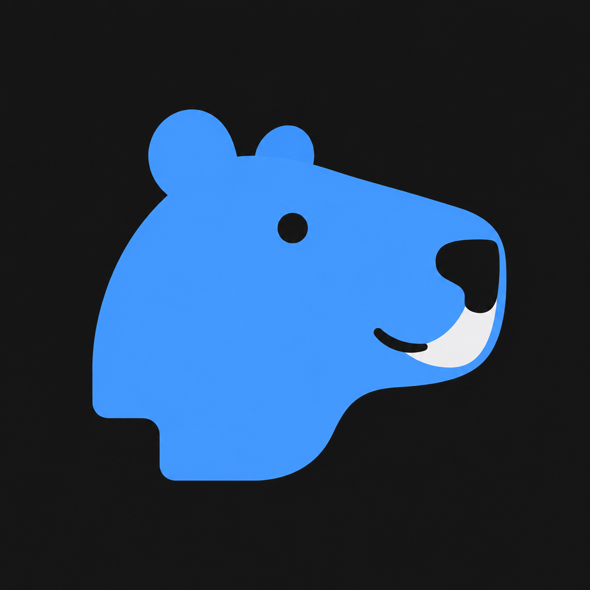

<p align="center">
  
</p>

<h1 align="center">Agenvas</h1>

<p align="center">可自托管的 AI 创作画布，让文字、图片、视频、音频与 Agent 在同一个工作空间中协作。</p>

<p align="center"><a href="README.en.md">English</a> · <a href="#使用方法">使用方法</a> · <a href="LICENSE">ELv2</a></p>

## 功能

- **画布创作**：创建文字、图片、视频、音频和 Agent 卡片，支持拖拽、框选、连线、缩放、锁定与一键整理；右键可直接上传本地媒体并创建节点。
- **直接生成**：在卡片中编辑提示词、选择模型、添加参考素材并运行。支持排队、取消、历史版本切换与重新生成；图片编辑和后处理创建独立派生节点。
- **Agent 协作**：读取明确绑定的上下文、创建和修改文字、摆放卡片；支持持续会话、创作 Skill、公开回答流和执行记录。Agent 提出的媒体生成批次须由用户批准后执行。
- **素材复用**：项目资源、跨本人项目复用的个人资产库、图片/视频提示词模板、媒体风格，以及图片、视频、音频参考输入。
- **图片处理**：画笔标注、裁剪、旋转、镜像、放大和深度提取；智能编辑、扩图、重打光等 AI 操作使用配置的媒体能力。
- **模型与存储配置**：管理员管理 LLM、媒体连接、已发布能力和默认模型；支持本地文件及 OSS/COS/S3 存储，可独立配置视频参考的媒体中继。
- **运行与恢复**：持久化任务、调用日志、用量记录、断线事件补发和项目导出清单。结果未知（UNKNOWN）时由用户显式重试，系统不自动重复提交生成请求。
- **界面语言**：中文、英文、俄文和日文共用同一套界面。

已有媒体适配器包括 GPT Image、Google Nano Banana、火山方舟 Seedance、Seed Audio、ComfyUI 固定模板，以及 RunningHub 固定 V2 协议的工作流/AI 应用。各模型可用的输入、参数与操作由管理员发布的能力决定；适配器实现不等于所有官方端点或模型均已实测。

当前为开发版本，面向单管理员自托管使用。已有部分图片中转端点的真实生成记录，完整真实 LLM/图片/视频链路、其他 Provider 兼容性与生产发布门禁尚未全部验收。实际检查范围以[开发清单](docs/DEVELOPMENT-CHECKLIST.md)为准。

## 使用方法

### 1. 启动服务

准备 Docker Engine / Docker Desktop 与 Docker Compose，在仓库根目录执行：

```sh
cp .env.example .env
```

编辑 `.env`，填写以下配置：

| 配置 | 用途 |
| --- | --- |
| `AGENVAS_DB_PASSWORD` | 独立随机数据库密码，必填 |
| `AGENVAS_BOOTSTRAP_SECRET` | 一次性管理员初始化密钥，至少 24 字符，必填 |
| `AGENVAS_CREDENTIAL_MASTER_KEY` | 32 字节随机密钥的 Base64 编码；保存模型 API Key、云存储凭证或完整 ComfyUI 地址前需要设置 |

真实凭据只保存在本地 `.env` 或服务端配置中；加密主密钥与数据库备份分开保管。

```sh
./deploy/update-local.sh
```

脚本构建镜像、更新容器并等待健康检查，保留数据库与素材卷。默认部署使用真实模型配置模式；启动与登录本身不需要 GPU 或模型 Key。

打开 [初始化页面](http://127.0.0.1:8088/setup)，输入初始化密钥并创建管理员，再到 [登录页面](http://127.0.0.1:8088/login) 登录。

### 2. 配置模型

- **文字与 Agent**：在设置的“模型配置”中添加 OpenAI 兼容端点、模型 ID 和 API Key。Agent 使用前须由管理员运行工具调用诊断；页面会提示可能发生的调用费用。
- **图片、视频与音频**：在“媒体配置”中创建连接、发布能力，并设置各类默认模型。未配置真实能力时，默认部署的媒体能力目录为空。
- **视频参考中继**：本地部署使用 Seedance 视频参考时，在“存储设置 → 媒体中继”选择可公网访问的 OSS/COS/S3 连接，默认存储仍可保持本地。步骤与限制见[媒体中继说明](docs/media-relay-design.md)。

ComfyUI 使用受信固定模板；RunningHub 使用管理员发布的目标与参数契约。模型凭证在服务端加密保存，配置轮换不会改变已受理任务固定的连接版本。

### 3. 在画布中创作

1. 创建项目，进入画布，通过右键菜单添加卡片或上传图片、视频、音频。
2. 在文字卡片中编辑内容或使用模型生成；在媒体卡片中选择模型、填写提示词，并按能力要求添加参考素材。
3. 检查输入与预计费用（未配置价格时显示未知），点击运行。完成后预览、选用结果，或在节点内重新生成并查看历史版本。
4. 需要 Agent 协助时，添加 Agent 卡片，明确绑定上下文、选择 Skill 并输入任务；点击发送即可开始，服务端会自动检查模型、输入与固定版本。媒体提案在对话中统一批准或拒绝。
5. 将结果保存到“我的资产”以便复用，或导出项目清单。项目清单包含数据与素材元数据，完整备份还须保存数据库及媒体文件。

生成请求结果未知时，先查看任务和调用记录；显式重试会创建独立尝试，可能产生重复费用。取消只停止本系统的后续编排，不保证外部服务停止或退款。

### 更新、停止与备份

更新仓库代码后，在根目录再次运行 `./deploy/update-local.sh`。基础镜像固定 digest，脚本不会自动升级基础镜像版本。

```sh
# 停止默认部署，保留数据库与素材卷
docker compose --env-file .env -f deploy/compose.yaml down
```

- 默认 Web/API/数据库端口为 `8088` / `8080` / `5432`，仅绑定本机；可通过 `AGENVAS_WEB_PORT`、`AGENVAS_API_PORT`、`AGENVAS_DB_PORT` 修改，隔离实例使用独立 `COMPOSE_PROJECT_NAME`。
- 对外部署需配置 HTTPS、反向代理与安全 Cookie（`AGENVAS_SECURE_COOKIES=true`）。资源上限见 `.env.example`；前端构建堆默认 1536 MiB，可通过 Docker 构建参数 `FRONTEND_BUILD_HEAP_MB` 调整。
- 升级前备份数据库、媒体、配置及当前/历史加密密钥。旧 V1–V77 开发库不能直接升级到重建后的 V1 基线；恢复需匹配原版本并先启用恢复模式。具体流程见[备份与恢复说明](docs/operations/backup-restore.md)。
- 系统日志位于设置页，仅管理员可访问；保留本次后端进程的有界输出，重启后清空。

## 本地开发

技术栈：Vite、React、TypeScript、React Flow、TanStack Query、Zustand；后端为 Java 21、Spring Boot、Spring AI、jOOQ、PostgreSQL、Flyway。前端为静态 SPA，业务 API 与 SSE 由 Spring Boot 提供。

工具链使用 JDK 21、Node 24 LTS（24.12+）与 pnpm 12.5.1，完整版本见[依赖基线](docs/dependency-baseline.md)。

### 容器开发环境（Mock）

填写 `.env` 中的数据库密码与初始化密钥后，可启动独立开发环境：

```sh
docker compose --env-file .env -f deploy/compose.dev.yaml up -d --build
# 停止开发版，保留其数据卷
docker compose --env-file .env -f deploy/compose.dev.yaml down
```

开发版显式启用文字与媒体 Mock，无需外部模型账户。图片、视频及音频为合成演示素材，音频是提示音，不代表真实模型生成效果。打开地址与初始化流程同上。

默认部署与开发版的 Compose 项目名分别为 `agenvas`、`agenvas-dev`，数据卷隔离，默认端口相同。并行运行时需分别设置项目名和端口。

### 源码调试

```sh
# 前端：在一个终端中运行
cd frontend
corepack pnpm install --frozen-lockfile
corepack pnpm api:generate
corepack pnpm dev
```

```sh
# 后端：在另一个终端中运行，先配置环境变量与 PostgreSQL
cd backend
./mvnw spring-boot:run
```

后端直跑需提供 `AGENVAS_DB_URL`、`AGENVAS_DB_USER`、`AGENVAS_DB_PASSWORD` 与 `AGENVAS_BOOTSTRAP_SECRET`；仓库根目录 `.env` 不会由 Spring Boot 自动加载。源码运行默认使用 Mock，媒体处理需要本机 FFmpeg/FFprobe；可通过 `AGENVAS_MEDIA_TOOLS_FFMPEG`、`AGENVAS_MEDIA_TOOLS_FFPROBE` 指定路径，深度提取另见[本地图片处理配置](docs/local-image-processing.md)。Vite 默认运行于 `5173`，将 `/api` 代理到 `localhost:8080`。

```text
frontend/       前端页面与画布交互
backend/        业务 API、Agent Runtime 与任务处理
contracts/      权威 OpenAPI 与内容 Schema
configs/        Agent、Skill 与受信媒体工作流配置
deploy/         Compose、Nginx 与容器构建
docs/           产品规格、设计、依赖与验收记录
```

贡献前阅读 [AGENTS.md](AGENTS.md)、[MVP 规格](docs/MVP-SPEC.md)和[开发清单](docs/DEVELOPMENT-CHECKLIST.md)。安全报告与当前支持范围见 [SECURITY.md](SECURITY.md)。

## 许可证

Agenvas 主项目采用 [Elastic License 2.0（ELv2）](LICENSE)，允许在协议条件下使用、复制、修改和分发源码，包括自托管使用。

ELv2 限制向第三方提供可访问软件实质性功能的托管或管理服务，禁止规避许可证密钥功能以及移除许可、版权等声明。它属于源码可用许可证，不是 OSI 批准的开源许可证；具体权利与限制以 [LICENSE](LICENSE) 和 [Elastic 官方条款](https://www.elastic.co/licensing/elastic-license)为准。
