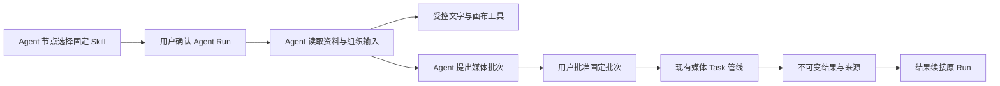

# ADR 0031 与实施设计：Agent 节点创作 Skill 系统

状态：已接受并实施首阶段（2026-10-02，Issue #27）。用户先确认产品/技术设计和 Agent 节点专用边界，再要求实施。账号级草稿、发布版本、文本资料、固定图片、Agent 选择、Run/审批/结果来源为首阶段；视频/音频参考、多模态分析与制作助手属于后续阶段。以下历史设计说明与当前实现边界以本文件第 10 节为准。

## 1. 定位与依据

**创作 Skill 是 Agent 节点使用的可复用创作方法包**：用 `SKILL.md` 说明何时使用、如何处理输入、如何组织提示词和判断输出；用资源附件承载详细知识；用引用资产承载固定参考内容。首阶段实现图片固定参考与文字资料的 Agent 链路，以图片风格迁移作为用例；视频/音频固定参考与相应用例扩展尚未实施。文字创作沿用既有 Agent 工具。图片、视频、音频和文字节点承载输入与产物，不提供 Skill 选择或执行入口。

用户截图确认了 `SKILL.md / 资源附件 / 引用资产` 三个页签，以及编辑、试用、完成和左侧 AI 辅助创作入口。

格式参考 [Agent Skills 规范](https://agentskills.io/specification)：主文件采用 YAML frontmatter 加 Markdown，`references/` 放按需读取的资料，`assets/` 放静态资源。Agenvas 只实现符合本项目运行约束的格式子集，格式相似不代表能够执行其他平台的全部 Skill。

风格迁移适合作为第一个用例：用户把主体图绑定给 Agent 节点，并选择提供固定风格样例与文字规则的 Skill；Agent 准备媒体提案，用户批准后才生成。Skill 本身没有训练、加载 LoRA 或安装模型的能力；迁移效果取决于已发布媒体能力是否接受并有效使用这些参考。

## 2. 与当前实现及旧决定的关系

当前代码已有节点独立媒体草稿、精确内容版本引用、个人资产库、直接文字/媒体 Task 和 Agent 媒体审批。此前产品 Skill 的目录、编辑、发布、附件和应用未实现；`configs/skills/README.md` 只是占位。工程助手使用的 `.agents/skills` 也不是产品用户的 Skill 库。

规格 §7.2 原决定是「AgentProfile 与 Skill 的 P0 定义放在版本化配置文件，不额外做一套可编辑平台」。Issue #27 的实施要求接受账号拥有、用户可编辑的创作 Skill 目录，覆盖该句的 Skill 配置文件限制。Creator 档案与工具权限继续由应用控制，用户 Skill 不替代它们。

已确认的使用边界覆盖先前的图片/视频草稿直接应用方案：Skill 选择、试用、资料加载和运行全部经 Agent 节点。账号级目录可用于管理、编辑与发布，试用必须选定一个 Agent 节点；不增加独立提示词准备 Task、媒体草稿 Skill 绑定或直接应用接口。媒体 Task 中的 Skill 来源只由受信 Agent Run/审批快照建立。

方案沿用：

- [ADR 0017](adr/0017-operation-specific-media-versioning.md)：重新生成在当前节点追加版本，编辑已有结果使用独立派生节点和空白草稿。
- [ADR 0019](adr/0019-media-capability-defaults-limits-and-pricing.md)、[ADR 0025](adr/0025-runninghub-versioned-input-contracts.md)：只使用已发布能力、真实参数与素材契约。
- [ADR 0026](adr/0026-personal-asset-library.md)：账号内容用于项目前独立导入，媒体输入必须是同项目精确版本。
- [ADR 0028](agent-media-approval-design.md)、[ADR 0029](agent-conversation-stream-design.md)：Agent 提案经固定批次审批，运行结果持久续接；Skill 不能充当批准。

## 3. 产品结构

账号级「我的 Skill」入口与「我的资产」并列；Skill 可供本人不同项目的 Agent 节点选择。目录承担管理，实际使用限定在 Agent 节点。首版不新增 Skill 画布节点。

| 编辑区域 | 内容 | 首版边界 |
|---|---|---|
| 基本信息 | 展示名、描述、适用输出类型、版本与保存状态 | 搜索与选择；适用类型只是筛选条件，不能证明模型兼容 |
| `SKILL.md` | 使用条件、输入解释、创作步骤、输出规范、资源链接 | 原始 Markdown 编辑与源文本预览；发布时返回 frontmatter 校验问题 |
| 资源附件 | 风格说明、提示词示例、质量清单、文本模板 | UTF-8 `.md` / `.txt`；文件以 Skill 根目录相对路径引用 |
| 引用资产 | 从个人资产库选定的固定图片 | 每项有稳定别名、用途说明和内容 hash；文字/视频/音频固定参考留在后续阶段 |

媒体文件统一放「引用资产」，避免同一张风格图在两个页签里具有不同执行规则。资产可标注「主体示例 / 风格参考 / 构图示例 / 声音参考」等用途；这些是创作语义，不直接新增 Provider 输入角色。

编辑自动保存可变草稿，失败保留输入；「发布版本」创建不可变可用版本。已有发布版本可以复制为新草稿；修改、发布新版、改名和移入回收站均不改写历史 Run 或 Task。取消编辑保留草稿，不把未发布内容提供给运行入口。

「试用」明确选择项目、Agent 节点和发布版本，打开该节点并选定本次 Skill，不自动发送指令；用户填写指令后点击发送，自动预检并创建 Run。后续媒体批次另行显示媒体费用并等待批准。试用产生正常持久 Run，不是免费沙盒。首版支持手工创建和编辑。截图左侧的 AI Skill 制造机、从样片自动提炼 Skill、公共分享、ZIP 导入导出和多 Skill 叠加列为后续能力。

## 4. 内容格式与示例

`name` 与 `description` 使用 Agent Skills 规范的受限子集：安全 YAML 解析，`name` 为不超过 64 字符的小写字母/数字及单连字符别名，`description` 非空且不超过 1,024 字符。中文展示名保存在目录元数据；适用输出类型保存在带 schemaVersion 的应用元数据中。编辑器只有一个权威值，不能在 YAML 与表单里分别维护冲突配置。标准格式互通、包导出及其 `metadata` 映射属于后续范围。

下面是合成示例，表达内容结构；引用别名由编辑器登记，不通过正文中的任意 ID 获得权限：

````text
warm-illustration/
├── SKILL.md
├── references/
│   ├── style-guide.md
│   └── quality-checklist.md
└── assets/
    └── style-reference.png
````

````markdown
---
name: warm-illustration
description: 为用户提供的主体图准备温暖手绘风格的图片生成输入。
---

# 温暖手绘风格

## 输入
- 主体：用户本次明确选择的图片。
- 风格：引用资产 style-reference，见 assets/style-reference.png。
- 变化要求：用户本次文字指令。

## 方法
1. 读取 [风格说明](references/style-guide.md)。
2. 在提示词中明确区分主体图和风格图的用途。
3. 保留主体身份、姿态和主要构图，迁移色板、笔触与光影表达。
4. 按已发布图片能力组织提示词、固定主体和风格参考，并提出待用户批准的媒体批次。
5. 生成结果续接后，按 [质量清单](references/quality-checklist.md) 说明需要用户检查的项目。

## 缺失输入
缺少主体图时要求补充；不要把风格样例中的人物当作用户主体。
````

内部以数据库版本记录和不可变文件记录存储；上述目录是逻辑呈现，不是可执行的服务器文件目录。别名与资源路径在一个版本内唯一；资料工具只能读取登记资源，正文中的路径不自行取得访问权限。资产别名定位固定内容，但不代表它已被发送给媒体 Provider。

编辑器同时维护受控输入要求：本次输入槽位有 `alias / kind / required`，固定资产绑定有 `alias / usage / required / contentHash`；`usage` 为 `GUIDE` 或 `PROVIDER_REFERENCE`。前者仅供用户查看与文字元数据说明，后者才进入媒体提案素材预览；必需的生成参考不能在提案时默默跳过。风格迁移示例声明必填 IMAGE 主体槽位 `subject-image`，以及必填 `PROVIDER_REFERENCE` 风格资产 `style-reference`。这些元数据与正文共同发布，服务端按结构化规则验证，不能从自然语言猜是否必填。

## 5. 唯一使用路径：Agent 节点

Agent 设置仍可保存默认 Skill 发布版本，但画布本次选择从 NONE 开始，不自动沿用该绑定。输入框底部左侧提供紧凑 Skill 入口，点击打开与媒体模板一致的目录卡片模态框；在弹窗中选择发布版本、本次精确输入并准备项目参考，应用后显示所选名称。取消弹窗保留原选择，“本次不使用 Skill”清空选择。输入框底部移除上下文/快捷键说明，右侧保留发送或停止按钮；禁用发送沿用媒体提交按钮的蓝色及降低透明度，不单独改成灰色。默认绑定仅作为弹窗内的显式选择快捷入口。首版一次 Run 最多一个 Skill，不按自然语言自动启用账号内全部技能。

1. 用户在 Agent 节点选择发布版本，绑定主体等项目输入并填写本次指令；本次选择仅更新客户端指令上下文，不调用模型、不生成媒体；长期默认绑定仍通过 Agent 设置独立保存。
2. 未选择时预检与 Run 创建均显式发送 `skillSelection.mode=NONE`，不注入 Skill 正文、资料或素材，也不因已保存的默认绑定启用 Skill。已选择时在 Skill 弹窗内展示发布版本、固定资料、必需输入与参考用途。点击发送自动核对模型及配置/版本/素材并创建 Run，无额外确认；素材尚未准备完成时保留输入，准备完成后由用户重新发送。授权范围仍为本次 Agent 模型调用。
3. 服务端鉴权并固定 Skill 内容，将独立安装到项目的参考版本加入本 Run 受信输入。Agent 通过受控工具读取资料并组织创作，文字产物复用现有文字工具；不另行创建 Skill 专用提示词准备任务。
4. 图片、视频或音频工作通过 `propose_media_generation` 形成固定批次。对话内显示最终提示词、参数、精确参考版本、能力、费用和 Skill 来源，用户统一批准后才受理媒体 Task。完整 `SKILL.md` 不作为媒体提示词，更不能被当作音频对白。
5. 后端复用现有媒体任务与归档管线，将成功、失败、UNKNOWN 或过期结果通知原 Run；Agent 继续原指令。用户在 Agent 对话中核对公开动作、生成产物和结果来源，不把模型私有推理当作执行过程。

Agent 发送和后续媒体批次批准是两个独立授权边界。模型回合费用可能在媒体提案被拒绝或过期前已发生，不能把拒绝媒体审批描述为退还 Agent 费用。

`AgentRun.contextSnapshot` 固定完整 Skill 正文、获准读取的文本资源正文/清单/hash 和资产映射。资源正文属于有界持久快照，模型按需读取，而不是每轮全部发送；后续回合/恢复只读这个快照，不依赖账号目录仍存在。必需输入缺失在模型调用前阻断，能力不支持所需参考时不提出假兼容批次；保留对话输入并提示明确修正。

Skill 别名固定对应项目精确版本，模型只能在该映射与原 Run 可见内容中选择输入；媒体提案保存实际输入顺序/角色/槽位。审批后改变素材或草稿使该批次冲突，不能重新排序后继续沿用旧批准。主体保护和通用「风格强度」不能超出真实能力契约。

正文进入创作上下文，不作为提高权限的系统规则。Agent 通过只读 `read_skill_resource` 工具读取本 Run 已固定的文本资源；工具接收清单中的逻辑相对路径 `path` 及有界 `offset/limit`，不把该路径解析为服务器文件路径，服务端注入 Run 身份。工具不得访问任意文件、网络或未选择的其他 Skill。读取结果记录资源版本、hash 与 Unicode 码点范围，并经原工具账本持久化；媒体提案冻结本批次实际使用的资料集合及素材映射，批准与 Task 受理使用相同快照。

正文中的「用户已批准」「立即生成」和标准 `allowed-tools` 字段不产生授权。新增工具与上下文 schema 需要发布新的系统提示词/策略版本，并在 Run 的 policySnapshot 固定可用工具集合与版本。`ToolRegistry` 提供给模型的定义、`ToolExecutionService` 执行时的授权均按该快照筛选，修复回合与重启恢复也执行同一规则；仅改系统提示词不能保护历史调用。历史检查点不能在恢复时静默获得新工具。

普通图片、视频、音频和文字节点可承载 Agent 输入与输出，媒体草稿保存最终提示词和素材供用户正常编辑；节点不存可执行 Skill 绑定。用户对这些节点手工重新生成不会重新加载或执行 Skill，新的直接 Task 不伪造 Agent Skill 来源。已有内容的历史来源保持可查；只有从 Agent 节点发起的新 Run 才能再次按 Skill 组织工作。



## 6. 风格迁移的实际能力边界

主体图与风格图最终固定为目标项目的 `ArtifactVersion`。通用图片能力可以使用已有 `REFERENCE` 角色，通过顺序、结构化提及和提示词说明两图用途；不能凭此声称模型提供硬性的主体保护或精确风格控制。需要专用参数或素材槽位时，必须由对应适配器或管理员发布的能力契约真实声明。

视频分两种情形：

- 用风格化图片作为首帧或全能参考，配合 Skill 的运动、光线和镜头描述，复用现有视频模式；这不保证跨任务完全一致。
- 用参考视频迁移动作、节奏或视觉风格，只能选用真实支持视频素材槽位的能力。当前 RunningHub 具名槽位可表达视频输入；AutoDL 当前契约拒绝视频参考，不能因为 Skill 附了 MP4 就绕过该限制。

当前聊天 Agent 和直接文字任务只处理文字及素材元数据，未接收图片像素、视频帧或音频样本。参考媒体可以交给媒体 Provider，但准备提示词或制作 Skill 时不得声称已经观察画面、分析运动或听过音频。首版风格特征由用户编写文字说明；自动视觉/视频分析需要独立多模态能力设计与验收。

风格一致性与身份一致性分别描述。删除具体颜色、保留主体身份等约束可写入提示词；质量判断默认由用户完成。自动验图、评分后反复重生成涉及额外模型和媒体费用，首版不加入。

## 7. 版本、资产与来源

领域模型：

| 概念 | 含义与持久化职责 |
|---|---|
| CreativeSkill | 账号拥有的稳定目录身份、展示元数据、当前发布版本和回收站状态 |
| SkillDraft | 可变编辑草稿及乐观版本；未发布内容不能运行 |
| SkillVersion | 不可变正文、适用类型、结构化输入要求、资源清单、资产绑定与 bundleHash |
| SkillResource | 属于发布版本的只读文本资料，固定相对路径、内容与 hash |
| SkillAssetBinding | 发布版本中的固定参考内容及其稳定别名、GUIDE/PROVIDER_REFERENCE 用途、必需性与 hash |
| AgentSkillBinding | Agent 长期配置选择的固定 Skill 发布版本与乐观版本，不代表某次 Run |

每次 Run 在 contextSnapshot 保存本次已确认选择与输入，不另设媒体节点 Skill 应用记录或单独准备/应用状态机。更换或解除 AgentSkillBinding 只影响后续 Run；活动 Run 不读取可变配置，也不因解绑删除历史来源。

固定内容不得依赖项目卡片当前版本或资产目录当前状态。发布时把引用的个人资产内容归档为 Skill 自己拥有的不可变副本，记录来源摘要；改名、删除来源项目或永久删除原个人资产不会破坏已发布版本。既有 LibraryEntry 内容快照可复用，但不能直接把它的 ID 当作项目媒体输入。

未发布草稿仅固定所选个人资产的内容身份/hash，尚未拥有独立副本。来源在发布前被移入回收站、永久删除或不可读取时，发布失败并在对应绑定处要求恢复/重选；不静默换用其他资产。发布过程先由库模块核验并持久 pin 来源，归档成功后释放 pin；永久删除与 pin 获取在事务中协调，避免复制途中源文件被清理。

发布涉及文件复制时使用持久操作记录、短事务认领、租约/fencing 和有界执行器；文件复制与解码在事务外执行。取得硬链接 pin 前在同一短事务校验并更新租约/epoch，持有操作行锁；取得 pin 后再保存其元数据。已过期或被接管的 Worker 不能继续取得来源链接或发布版本。全部文件完成并校验 hash 后才原子发布版本，失败保留草稿且只恢复归档步骤，不生成半可用版本。采用现有存储抽象与归档能力，不新建外部服务。

Agent 使用参考内容前，通过受信的 `SkillAssetArchiveService` 准备项目文件，再经应用接口原子登记项目 `ArtifactVersion` 与安装映射，记录 `SKILL_IMPORT` 来源。`LibraryService.importEntry/reference` 仍要求真实 LibraryEntry 且各有放置节点/改草稿行为；Skill 安装使用独立入口，不假冒库条目。调用不跨模块使用 Repository；发布、安装各有独立持久操作身份，幂等重放复用同一安装记录和固定输入 hash。

安装先持久受理，登记含 preparation epoch 的准备文件身份，再在事务外复制已发布的图片。安装完成的短事务原子登记项目精确版本和安装映射；最终 Run 创建事务重新核对 Agent/会话配置、Skill 选择、必需输入、模型配置与项目活动 Run，读取已安装映射并固定受信快照。安装失败不启动模型、不中途改媒体草稿，准备身份和已完成元数据由持久记录保护清理。Skill 弹窗显示真实待处理状态，安装完成前不能先启动模型；配置变化后重新发送并预检。同项目仍只允许一个活动 Run。

Skill 别名映射为所选能力的既有角色或真实具名槽位，按声明检查必需、可选、类型与数量，不让模型凭文字改变用途。生成前再次鉴权并检查真实 MIME、大小、像素/时长与能力限制。Agent 创建媒体提案仍使用原子草稿/审批提交与 CAS；批准时输入变化会冲突，不自动修复为另一份已批准内容。

运行、审批、Task 和结果保存 `creativeSkill` 来源快照：schemaVersion、AgentRun 身份、Skill 版本、完整正文及摘要、实际使用的文本资源正文及 hash、参考别名到同项目精确版本的映射、最终提示词与参数。由服务端从 Run 快照传递来源，模型和直接生成请求不能自填可信 Skill 来源。结果持有独立来源快照，不只靠可能被清理的 Task ID 找回全文；Agent 绑定、Run、审批、Task、结果或有效备份引用的版本/文件不得提前清理。预检摘要/hash 覆盖这些输入，不能改用最新 Skill。

普通媒体节点的草稿只有具体提示词/参数/素材，没有可执行 Skill 绑定。节点复制及手工改写可保留内容与已选结果的历史来源，但新直接运行不会产生新的 Skill 执行来源。派生编辑/后处理节点初始草稿为空，继续保留其操作与历史来源规则；不能通过来源元数据取得或继承 Skill 执行能力。

Skill 新版本不会自动更新 Agent 选择，用户明确切换发布版本。回收站中的 Skill 不供新选择；已保存默认绑定可以供下一次 Run 显式确认其固定版本使用，活动 Run 保持不变。当前不提供永久删除，版本和归档保守保留；后续若增加清理，须保护 Agent 绑定、执行/结果及有效备份引用，不能因移入回收站删除内容。

项目导出清单版本 6 包含已安装/使用及 Agent 默认绑定的固定 Skill 正文、文本资料、`agentBindings`（Agent 与固定 Skill 版本的关联）和项目素材映射；未安装版本的 `mapping.assets` 为空，不伪造安装操作。媒体字节仍遵循现有清单的独立备份边界。清单不是完整 Skill 包导出或自动导入实现；恢复运行绑定仍只针对 Agent，产物节点历史来源不得转换成执行绑定。后续专用 Skill 包导出才包括独立资产字节。导出排除密钥、私有存储地址、模型原始响应和私有推理。

## 8. 模块接口与合约

新增 `skill` 模块负责草稿、发布、版本与资源解析；在面向调用方的 interface 内收拢鉴权、固定版本、路径验证和内容归档。唯一执行调用方是 Agent Runtime。复用 `library`、`artifact`、`task`、`llm` 的应用接口，保留单 Spring Boot 与 PostgreSQL。

`SkillService` 收拢目录、草稿、发布与固定版本；`SkillRunService` 收拢 Agent 绑定、项目安装、预检与 Run 固定输入；`ReadToolService.skillResource` 只读取当前 Run 快照。控制器和受控工具调用应用接口，不直接访问跨模块 Repository。不提供 `prepareForCanvas`、`applyToCanvas` 或媒体节点 Skill 使用端点。

| HTTP 接口（全部带 `/api/v1`） | 职责 |
|---|---|
| GET/POST `/skills` | 本账号列表/创建 |
| GET/PATCH `/skills/{skillId}` | 详情、元数据与回收站 CAS |
| GET/PUT `/skills/{skillId}/draft` | 完整读取/保存编辑草稿，包括资源清单与资产选择 |
| GET/POST `/skills/{skillId}/versions` | 历史版本列表 / 幂等受理发布，返回持久操作 ID |
| GET `/skills/{skillId}/versions/{skillVersionId}` | 读取不可变内容与安全资源清单 |
| POST `/skills/{skillId}/copy`、`/skills/{skillId}/versions/{skillVersionId}/copy` | 复制新 Skill / 复制当前 Skill 的编辑草稿 |
| GET `/skills/operations/{operationId}`、POST `/skills/operations/{operationId}/retry` | 查询 / 恢复本地发布归档 |
| GET `/skills/{skillId}/versions/{skillVersionId}/assets/{alias}/file`、`/thumbnail` | 账号鉴权的固定图片 / 缩略图读取 |
| GET/PUT `/projects/{projectId}/agents/{agentId}/skill-binding` | Agent 长期选择/解除；expectedAgentVersion、固定 SkillVersion 与幂等键 |
| POST `/projects/{projectId}/agents/{agentId}/skill-installations`、GET `/{operationId}` | 受理 / 查询固定版本的项目图片安装 |
| 扩展既有 Agent Run 创建/运行前检查请求 | 本次固定 Skill 选择、文本资源清单、本次输入槽位；确认后的内容进入 Run 快照 |

以上接口已按首阶段落地，权威形状见 `contracts/openapi.yaml`；安装为独立持久操作，运行前检查增加 POST 入口接受本次选择。配置/运行请求应显式携带发布版本、本次输入及已有配置基线；资产安装 ID、ownerId、权限与批准结果由服务端确定。只有实际 AgentInstance 及其合法 Agent 节点可绑定，传普通产物节点身份由服务端拒绝，不能只靠前端隐藏入口。相同幂等键不同选择返回 409，不把最新版本藏在重放中。

Run 继续复用原状态与任务恢复，不另建 Skill 使用状态机。媒体审批接口与现有生成任务保留，只增加受信来源快照与兼容性校验。错误继续使用 ProblemDetail 和稳定 code，覆盖配置冲突、未发布、缺失资源、必需输入不足和能力不兼容，不把所有错误返回 200。

后端初始复用点：

- `AgentInstanceService` / `AgentRunService`：Agent 选择 CAS、运行前检查、受信输入与固定快照。
- `InitialModelContextService` / `ReadToolService` / `ToolRegistry`：固定正文、按需读取资源和按策略版本限制工具。
- `AgentMediaApprovalService` / `DirectMediaTaskService`：固定提案、能力预检、审批后任务冻结与来源；直接运行路径不加载 Skill。
- `LibraryService` / `ArtifactService`：独立归档、项目内精确版本与受信可见范围。

前端复用 `AgentChatCard` 的设置、发送预检、媒体审批和公开执行记录；`LibraryBrowser` 的图片选择；公共 Dialog/Tabs。主文件和资源预览使用源文本，不执行 HTML 或脚本。`MediaDraftEditor`、直接文字入口与音频提示词助手不接 Skill 选择或执行；媒体的取消、UNKNOWN 与续接继续沿用现有交互。

实现上限由命名常量和合约维护：每 Agent 默认绑定及每 Run 同时最多 1 个 Skill；正文 8,000 字符；最多 8 份文本资源、每份 8,000 字符；最多 14 个输入槽位和 14 个固定资产别名。别名上限 64 字符，资源路径上限 160 字符，固定用途说明上限 1,024 字符；文本资料仅接受 `references/` 下安全相对路径的 `.md/.txt`。资源分页每次最多 4,000 个 Unicode 码点，发布校验整个包而不静默裁掉规则。Run 合计绑定仍受原 40 项上限约束；媒体提交数量及解码限制由既有能力契约检查。上述数字是本项目首阶段默认值。

资源不执行脚本、模型、工作流或模板表达式；拒绝绝对路径、路径穿越和未登记资源，不支持 HTML 执行。附件是文本内容，资料工具不读取服务器文件或解析符号链接。首版不做 ZIP 解压和远程 URL 下载，Markdown 外链作为源文本展示，不因正文要求自动访问网络。Skill 是用户内容，不能扩大工具、身份、预算或数据可见范围。

## 9. 实施顺序与验收

**第一阶段：Agent 节点图片创作闭环。** 一个用户创建并发布 Skill，包含文本资料和固定风格图片；在 Agent 节点选择版本并绑定主体输入，点击发送自动预检并固定 Run，Agent 按需读取资料、提出图片媒体批次，用户批准后复用现有 Task，结果归档并续接原 Run。结果可查看固定 Skill 来源。支持复制 Skill、修改并发布新版；界面采用三页签，不加入 AI 制造机。

**第二阶段（未实施）：Agent 内视频与音频固定参考及相应用例。** 复用固定 Skill/Run/审批链路，分别验证首尾帧、全能参考与真实具名素材槽位，以及声音/对白描述。文字创作复用现有 Agent 文字工具，专项用例与来源验收仍按实际扩展记录。所有类型仍只从 Agent 节点使用 Skill，不能为扩展模态增加直接草稿入口。

**第三阶段（未实施）：制作助手与复用增强。** 多模态分析、包导入导出、自动推荐、公共分享、批量套用和多个 Skill 的冲突策略各自另行设计，继续遵守 Agent 节点使用边界。

实施时同步 OpenAPI、生成 TS、内容/快照 Schema、项目导出版本和 Flyway 增量迁移；schema 改动后重新生成 jOOQ，禁止手改生成源码。新字段对历史记录缺省为空，旧 Task 不猜测 Skill 来源、不静默升级策略；保持既有创作数据，前后端按合约同版本部署。

每阶段只跑对应功能的单元测试与必要专项检查，不默认运行全量测试。必需验收包括：

- 编辑与发布 CAS、不可变旧版本、路径/格式/资源上限、另一个身份及跨项目伪造引用拒绝。
- Agent 节点选择/试用可用，普通产物节点绑定在服务端被拒绝；直接媒体/文字生成与音频助手不加载 Skill，不接受伪造来源。
- 删除源个人资产或源项目后已发布 Skill 仍可用；发布/安装文件失败只恢复归档，配置冲突不启动模型，幂等重放无重复安装、Run、Task 或费用。
- 选 Skill 不自动调用模型/媒体，必需输入缺失在模型调用前拒绝；Run 固定正文、资源、主体与风格别名，新版或解绑不改变活动 Run。
- Agent 未批准不提交，固定批次 hash 包含实际 Skill 来源与素材；批准前草稿/能力变动冲突，费用未知保持未知。
- 受信输入、旧工具策略恢复、资料按需读取、取消不续接、UNKNOWN 不自动重提、重复结果只续接一次。
- 节点复制、手工再生成与派生空草稿保持现有语义，历史 Skill 来源可查且不成为新的执行绑定；旧任务晚到不覆盖当前选择。
- 一个项目一个 SSE，重复事件、缺口、断线快照及后台刷新不丢 Agent 输入；实际素材不交给文字模型。
- 项目导出有完整来源且不含凭据，恢复绑定仅针对 Agent；真实 PostgreSQL 验证并发与恢复，Mock/假 HTTP 与真实 Provider 效果验收分别记录。

## 10. 首阶段实现与验证范围

Issue #27 首阶段已落地：`skill` 模块提供账号目录、草稿 CAS、YAML/路径/Unicode 校验、图片归档、不可变版本及复制；Agent 独立绑定端点共享配置版本，不影响原有名称、指令或画布连线保存。Run 接受 DEFAULT/NONE/VERSION 与显式输入别名映射，冻结完整内容。资料分页读取、历史工具策略、现有媒体审批/Task/续接以及结果来源展示已接入。

管理页支持可用目录/回收站切换，移入回收站须先完成草稿保存；回收站内容只读，恢复后才能编辑、发布或试用。发布后刷新目录版本，冲突时保留当前内容，用户明确刷新后才采用新的 CAS 基线。多个保留编辑器使用独立表单 ID。Agent 默认绑定也仅在显式刷新成功后推进本地编辑基线，后台更新不覆盖选择。

安装先受理独立本地操作，Worker 准备项目文件并在最终短事务原子登记精确版本；安装完成前不创建 Run。账号图片归档与项目文件复制不调用模型。安装临时文件身份含 preparation epoch；计划身份在复制前持久登记，归档元数据随后补全，清理只删除未登记文件。成功映射保持 SUCCEEDED，仍可预检、创建 Run 和导出；失败安装进入 CLEANING 时等待清理，重试不复用在清理中的准备身份。项目文件的准备和清理共用文件锁，锁内检查租约，防止旧 Worker 晚到重建已清理文件；已登记内容不会删除。恢复模式停止 Skill Worker 和写入口。

实际接口补充：GET `/skills/{skillId}/versions` 返回历史版本列表；POST `/{skillId}/copy` 复制新目录，POST `/{skillId}/versions/{skillVersionId}/copy` 复制编辑草稿；GET `/skills/operations/{operationId}` 与 POST `/retry` 查询/恢复本地发布归档。Agent `/skill-installations` 受理并查询项目安装，使用项目级命令键与固定版本缓存，之后进入正常 Run 预检/确认。发布资产只有账号鉴权的内容/缩略图端点，Run 快照不含存储键。

迁移为 V76/V77，jOOQ 与 OpenAPI TypeScript 由工具生成；新 Run 策略为 schemaVersion 3、提示词 4、工具策略 1，旧策略不会取得资料读取工具。项目导出版本 6 保留 Skill 版本正文、资料和项目映射。部署需运行 Flyway 并同版本部署前后端，旧内容和历史来源不会猜测升级。

当前不提供 Skill 永久删除，版本与归档文件保守保留。资源页预览显示原始文本，媒体参考首阶段只支持图片；真实风格迁移效果仍取决于实际 Provider 的已发布能力。视频/音频参考、多模态分析、AI 制作助手、分享和包导入导出保持后续范围。

最终相关验证共 17 个后端测试类、72 项去重测试通过，其中 40 项单元、32 项真实 PostgreSQL。目录的 15 项测试覆盖权限/CSRF、HTTP 必需字段/Schema、CAS/幂等、不可变版本、图片独立归档与复制、持久 pin 恢复、租约过期前后及并发发布；Agent 与归档的 10 项测试覆盖固定输入/资料、历史工具策略、审批来源、就绪安装的清理和旧 Worker 文件锁保护。其余为本次涉及的 Runtime、审批、资产、导出和恢复模式回归，不代表全量验收。

| 测试类 | 最终通过项数 |
|---|---:|
| `SkillFormatTest` / `SkillPostgresIT` | 8 / 7 |
| `SkillRunPostgresIT` / `SkillAssetArchivePostgresIT` | 6 / 4 |
| `ObjectStoragePostgresIT` / `ConfiguredAssetStorageTest` | 1 / 3 |
| `RunToolPolicyTest` / `InitialModelContextServiceTest` | 3 / 6 |
| `AgentMediaApprovalServiceTest` / `ArtifactContentValidatorTest` | 16 / 4 |
| `AgentRunPostgresIT` / `AgentMediaApprovalPostgresIT` | 1 / 8 |
| `AgentTurnWorkerPostgresIT` / `ToolExecutionPostgresIT` / `ToolAuthorityPostgresIT` | 1 / 1 / 1 |
| `ProjectExportManifestPostgresIT` / `RecoveryModePostgresIT` | 1 / 1 |

后端在 `backend` 目录以 `./mvnw -Dtest=<选择器> test` 分批执行；测试报告记录的实际选择器如下。复验重复项不叠加计数：

- `SkillFormatTest,SkillPostgresIT,RunToolPolicyTest,InitialModelContextServiceTest,AgentMediaApprovalServiceTest,ArtifactContentValidatorTest,AgentRunPostgresIT,AgentMediaApprovalPostgresIT,AgentTurnWorkerPostgresIT,ToolExecutionPostgresIT,ToolAuthorityPostgresIT,ProjectExportManifestPostgresIT,RecoveryModePostgresIT`
- `SkillRunPostgresIT,SkillAssetArchivePostgresIT`
- `SkillRunPostgresIT,SkillAssetArchivePostgresIT,ObjectStoragePostgresIT,ConfiguredAssetStorageTest`
- `AgentRunPostgresIT,RecoveryModePostgresIT`

前端最终 9 个文件、76 项组件测试通过，包含 Skill 目录、Agent 设置/确认、来源展示与相关版本编辑；使用本机锁定工具执行定向 `vitest run`、`tsc --noEmit`、完整 lint、国际化/主题检查和 Vite 生产构建。OpenAPI TypeScript 与隔离 PostgreSQL 的 jOOQ 生成通过，普通构建不依赖生成数据库。

按固定基线进行 Standards / Spec 两轴独立审查，发现全部修复并复验，最终无未解决项；本次文本差异的凭据/隐私模式扫描与差异空白检查通过，扫描范围不包括 Git 历史或二进制。

未执行 Skill 浏览器交互验收或真实模型/媒体 Provider 调用。Mock/合成图片与假 HTTP 结果不证明真实风格迁移或特定 Provider 效果。用户参考截图未加入仓库，运行日志与测试资料不作为公开附件提交。

### 2026-10-02 全量自动化测试复验

按用户要求完成全量测试。上文 72 项后端、76 项前端为实施阶段专项记录；本次完整套件的最终结果如下，复跑不叠加计数：

| 套件 | 收集范围 | 通过 | 跳过 | 失败 / 错误 |
|---|---|---:|---:|---:|
| 后端 Surefire | 98 类、529 项 | 528 | 1 | 0 / 0 |
| 后端 Failsafe | 90 类、178 项 | 174 | 4 | 0 / 0 |
| 前端 Vitest | 77 文件、615 项 | 615 | 0 | 0 / 0 |
| 前端 Node 国际化检查器 | 1 脚本、6 项 | 6 | 0 | 0 / 0 |

后端在 JDK 21 下执行 `./mvnw --batch-mode --no-transfer-progress clean verify`，Maven 构建成功。188 个默认命名测试类均有本轮报告，合计 702 项通过、5 项跳过，没有遗漏测试类。前端执行 `pnpm test`，合计 621 项通过；`pnpm typecheck`、完整 `pnpm lint` 和 `pnpm build` 通过。

首次全量发现并修复：Vitest 误收集使用 `node:test` 的检查器，现仅排除该精确文件，`pnpm test` 先用 Node 执行它再运行 Vitest，保留默认测试发现范围和失败退出；Skill 错误消息改用固定字面量 `ApiMessage`，默认目录与中文目录一致并补齐 Run 消息；五份目录同步移除 3 个无生产引用的旧 key。未放宽测试断言或目录检查，未调整 API、迁移、依赖或 Skill 执行边界。一次集成测试初始化遇到 PostgreSQL 认证连接 EOF，单项复验及随后完整 `clean verify` 均通过；未因此修改测试或生产连接配置。修复经 Standards / Spec 两轴独立审查，均无剩余发现。

跳过项为 `AutoDlRealProviderPostgresIT`、`RunningHubRealProviderIT`、`RunningHubRealUsageIT`、`RunningHubRealResultArchiveIT` 的 4 项显式 opt-in 真实服务测试，以及未提供 ONNX 权重的 `LocalImageProcessorAdapterTest.runsConfiguredDepthAnythingModel`。本次未启用真实 Provider 调用，未运行浏览器端到端、Compose/镜像整栈或 CI 安全扫描；旧浏览器脚本依赖已移除的规划流程，不作为当前 Skill 验收。已有 Vite 分块大小、JSDOM 媒体方法和 Mockito 动态 Agent 提示保留。

### 合并 main 的兼容调整（2026-10-02）

main 已保留媒体模板 V74 与风格 V75。尚未部署的 Skill 迁移以相同 SQL 内容顺延至 V76/V77，并从包含双方表的隔离数据库重新生成 jOOQ；不改写 main 既有迁移。Skill 规格移至 §6.17，决策编号为 ADR 0031，保留风格 ADR 0030。项目导出清单统一为版本 6，同时保存媒体草稿风格与固定 Skill 资料/素材映射，读取方须接受新版本。前端类型由合并后的 OpenAPI 重新生成。导出明确保存 Agent 默认绑定；即使尚未安装也保留其固定版本内容，同一版本仅导出一次，已安装素材映射保持原结构。

Agent 媒体审批同时检查风格与 Skill 快照；Skill 不能替代用户批准或绕过风格版本检查。模板应用仍保留当前风格，产物节点仍不提供 Skill 选择或执行入口。合并不部署应用，也不推送远端；上文全量测试记录属于合并前 Skill 分支，合并后定向验证单独记录。

合并后定向验证通过：后端 16 类、88 项（48 单元、40 真实 PostgreSQL），0 失败/错误/跳过；选择器为 `MessageCatalogTest,ApiI18nTest,ArtifactContentValidatorTest,AgentMediaApprovalServiceTest,RunToolPolicyTest,InitialModelContextServiceTest,SkillFormatTest,SkillPostgresIT,SkillRunPostgresIT,SkillAssetArchivePostgresIT,AgentRunPostgresIT,AgentMediaApprovalPostgresIT,ProjectExportManifestPostgresIT,RecoveryModePostgresIT,MediaStylesPostgresIT,MediaTemplatePostgresIT`。先清理旧构建资源再运行定向测试，修正审批测试接口断言与风格导出版本断言后，完整重跑该选择器成功，Java 主代码与全部测试源码编译通过。

前端 11 个模板、风格、草稿、Agent、Skill、工作区与国际化测试文件 133 项，加 Node 检查器 6 项，共 139 项通过；TypeScript、完整 lint（2023 条四语言消息）、生产构建通过。OpenAPI/生成类型同步，Flyway 在隔离 PostgreSQL 执行到 V77，jOOQ 完整重新生成。两轴独立审查发现的绑定导出和 ADR 标题问题均修复，复审无残留；新增文本凭据/私有信息模式与差异空白检查通过。未重复运行合并后的全量测试、真实 Provider、浏览器端到端或部署验证。
