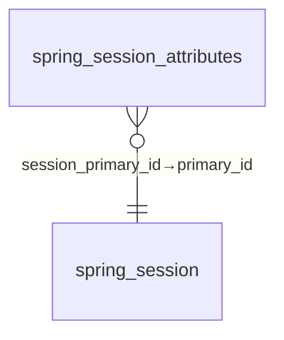
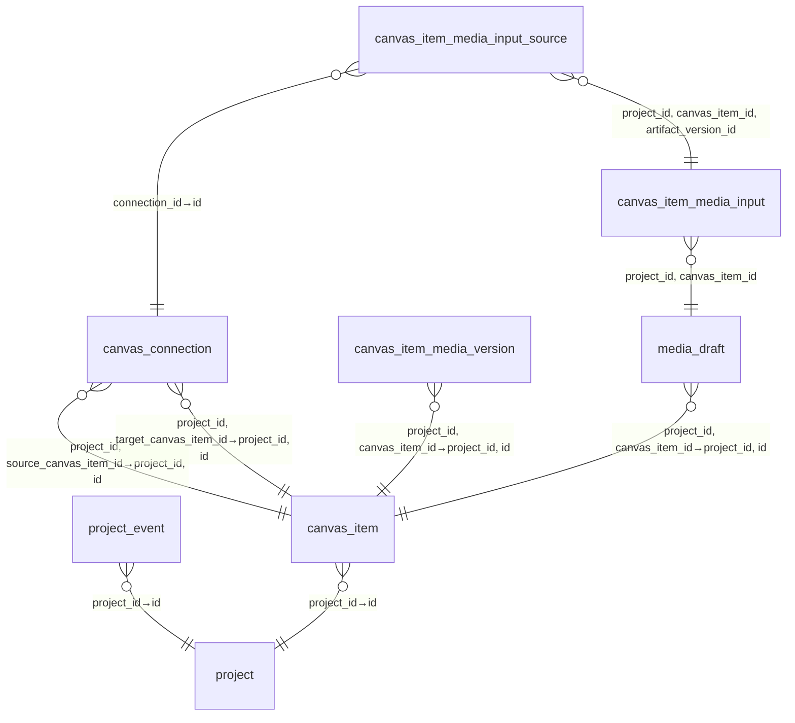
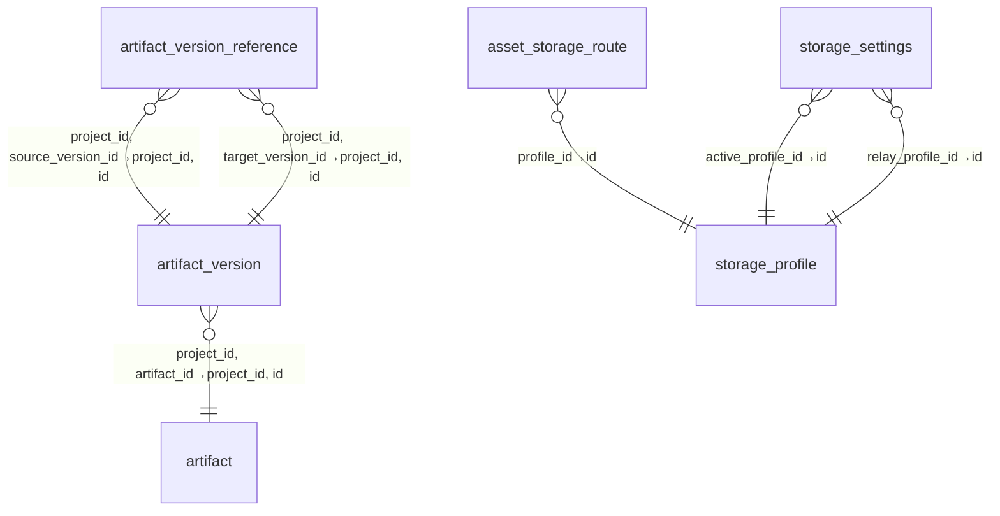
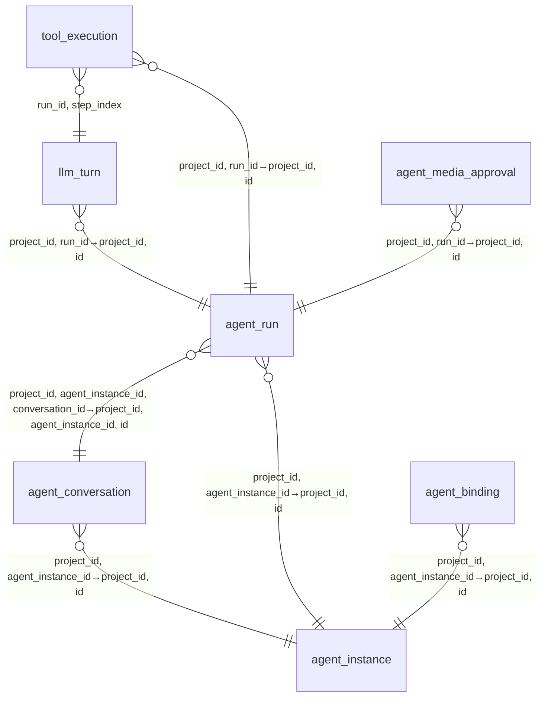
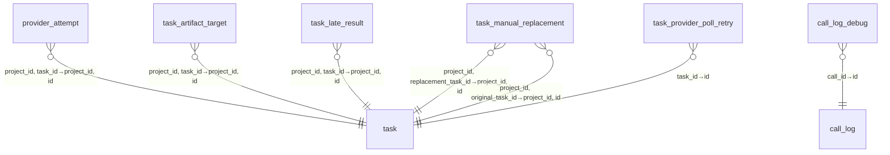
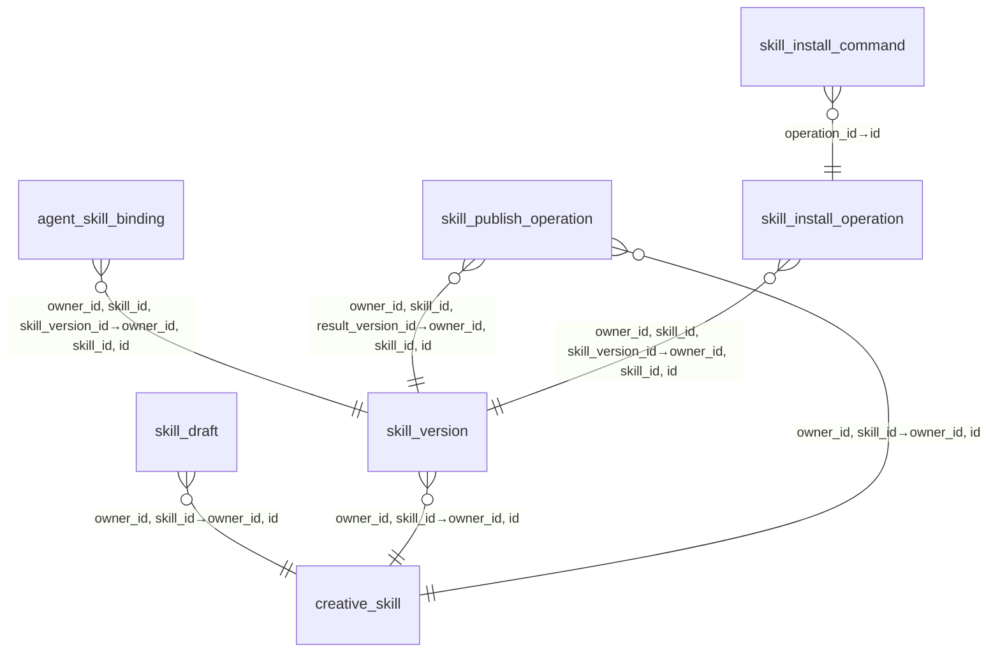
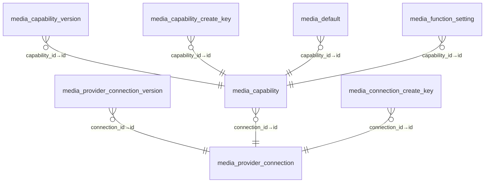
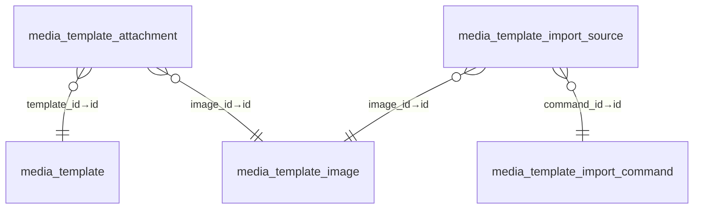
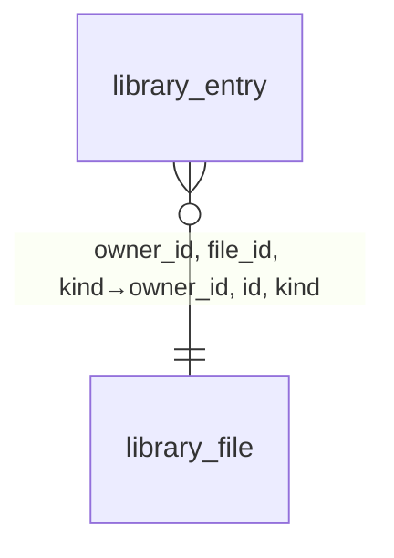

# 数据库 Schema UML 文档

> 本文由 `backend/src/main/resources/db/migration` 的 DDL 生成,与 jOOQ 生成代码 `backend/src/jooq/java/dev/agenvas/db/tables/` 一一对应。
> 覆盖 **70 张表、593 列、102 条外键**;测得的「废弃」结论见每张表备注与第 12 节。

阅读约定:

- 每节先给出该域内表的**作用**与**域内引用关系**(Mermaid ER 图),跨域引用在第 10 节按表列出。
- **引用**列 = 本表外键指向的表;**被引用**列 = 以本表为主键目标的表。
- `⚠` 标记为审计发现的死表/只写不读表。

---

## A. 身份、全局设置与提示词

| 表 | 作用 | PK |
| --- | --- | --- |
| `app_user` | 本地用户、密码摘要及账户状态 | id |
| `installation_lock` | 管理员初始化的单例事务锁行 | id |
| `llm_provider_config` | 不可变 LLM 连接版本与加密凭据；激活标记选择当前配置 | id |
| `llm_provider_config_counter` | 串行分配 LLM 连接配置版本的单例计数器 | id |
| `audit_debug_settings` | 全局调用调试开关，默认不保存调用正文 | id |
| `audit_log_retention_settings` | 全局调用日志保留期限及配置版本 | id |
| `prompt_definition` | 统一管理 Agent 与功能的创作提示词；消费者按稳定用途标识取用并冻结正文 | id |
| `media_style` | 媒体生成风格目录及内置风格缩略图 | id |
| `spring_session` | Spring Session JDBC 持久会话及过期索引元数据(Spring Session 框架管理) | primary_id |
| `spring_session_attributes` | Spring Session JDBC 序列化会话属性(Spring Session 框架管理) | session_primary_id, attribute_name |

## B. 项目与画布

| 表 | 作用 | PK |
| --- | --- | --- |
| `project` | 项目权限边界、当前活动 Run、事件序号与并发控制版本 | id |
| `project_event` | 与业务变化同事务提交的项目事件，项目内序号作为 SSE 水位 | project_id, seq |
| `canvas_item` | 画布空间卡片及卡片独立的标题、版本选择与内容选择 epoch — 含被取代列 `artifact_id`/`agent_instance_id` | id |
| `canvas_connection` | 画布卡片关系；输入来源和派生线不代表执行依赖 | id |
| `canvas_item_media_version` | 媒体卡片独占的结果版本历史 | canvas_item_id, artifact_version_id |
| `canvas_item_media_input` | 媒体卡片显式选取的精确输入版本、角色、顺序和显示颜色 | project_id, canvas_item_id, artifact_version_id |
| `canvas_item_media_input_source` | 媒体输入的手工或连线来源，允许同一输入保留多个来源 | id |
| `media_draft` | 媒体卡片独立草稿、参数、能力、风格和引用提及 | project_id, canvas_item_id |

## C. 产物、版本与存储

| 表 | 作用 | PK |
| --- | --- | --- |
| `artifact` | 业务产物身份及资源库默认版本；内容保存于不可变版本 | id |
| `artifact_version` | 不可变产物内容、固定输入及生成来源；触发器禁止更新和删除 | id |
| `artifact_version_reference` | 不可变版本之间的精确输入引用及顺序 | source_version_id, reference_role, reference_order |
| `asset` | 已校验、归档并发布的媒体字节及完整性元数据 | id |
| `asset_storage_route` | 媒体字节所在存储配置及可读取路由；独立于业务产物版本 | project_id, asset_id |
| `storage_profile` | 不可变本地或对象存储配置及加密凭据 | id |
| `storage_settings` | 当前存储配置选择及并发控制版本；已有资产保留原路由 | singleton |

## D. Agent 运行

| 表 | 作用 | PK |
| --- | --- | --- |
| `agent_instance` | Agent 卡片配置；请求身份和运行上下文保存在 Run 中 | id |
| `agent_conversation` | Agent 卡片的持久对话，接收每条用户消息后创建独立预算的 Run | id |
| `agent_run` | 单次 Agent 指令的持久执行状态及不可变上下文、策略快照 | id |
| `llm_turn` | 固定模型配置版本的持久模型回合，保存完整响应后才执行工具 | run_id, step_index |
| `tool_execution` | 按 Run、回合及 tool_call_id 去重的工具执行账本 | id |
| `agent_binding` | Agent 显式输入：固定引用不可变产物版本 | id |
| `agent_media_approval` | Agent 固定媒体批次、用户审批决定及原 Run 的结果通知状态 | id |
| `idempotency_record` | 按可信身份和作用域记录命令摘要与响应，拒绝同键不同载荷 | principal_id, scope, idempotency_key |

## E. 任务与 Provider 调用

| 表 | 作用 | PK |
| --- | --- | --- |
| `task` | 持久执行单元；短事务认领、租约及 fencing epoch 保护所有状态写入 | id |
| `provider_attempt` | 固定任务租约和连接能力版本的外部提交尝试；结果未知时禁止自动重提 | id |
| `task_artifact_target` | 任务固定目标与受理时的版本选择；结果不能覆盖并发用户选择 | task_id |
| `task_late_result` | 失效租约或取消后的晚到结果审计，不自动选用或启动后续任务 | id |
| `task_manual_replacement` | 用户显式批准的 UNKNOWN 重试对应关系和确认记录 — `confirmation_code` 为 CHECK 守卫列 | original_task_id |
| `task_provider_poll_retry` | 外部状态查询的重试计数；查询重试不代表重新提交生成 | task_id |
| `call_log` | Provider 调用公开审计元数据，不包含凭据或模型私有推理 | id |
| `call_log_debug` | 仅在明确启用调试时保存的已脱敏请求与响应正文 — 含死列 `schema_version` | call_id |
| `usage_ledger` | 使用量预留、结算与释放账本，记录估算或实际费用来源 | id |

## F. Skill 创作与安装

| 表 | 作用 | PK |
| --- | --- | --- |
| `creative_skill` | 用户创作 Skill 身份、当前发布版本和回收站状态 | id |
| `skill_draft` | Skill 可编辑草稿及内容格式版本 | skill_id |
| `skill_version` | 不可变 Skill 发布版本、内容包及完整性摘要 | id |
| `agent_skill_binding` | Agent 选定的 Skill 不可变版本 | agent_id, skill_id |
| `skill_publish_operation` | Skill 发布操作、素材归档进度、租约及临时引用清理 | id |
| `skill_install_operation` | 项目内固定 Skill 版本的安装操作、租约、结果和失败清理 | id |
| `skill_binding_command` | Agent Skill 绑定命令的幂等摘要与响应 — 含只写列 `agent_id` | owner_id, project_id, command_key |
| `skill_install_command` | Skill 安装命令幂等账本；多个命令可引用同一安装操作 — ⚠ 死表(全仓库零引用) | owner_id, project_id, command_key |

## G. 媒体连接与能力

| 表 | 作用 | PK |
| --- | --- | --- |
| `media_provider_connection` | 管理员媒体连接身份、平台和当前不可变连接版本 | id |
| `media_provider_connection_version` | 不可变媒体连接地址、精确来源摘要与加密凭据 | connection_id, version |
| `media_capability` | 管理员媒体能力身份、可用状态和当前不可变版本 | id |
| `media_capability_version` | 不可变媒体适配器输入契约、映射摘要与能力规格 | capability_id, version |
| `media_capability_create_key` | 媒体能力创建命令的幂等键与载荷摘要 | idempotency_key |
| `media_connection_create_key` | 媒体连接创建命令的幂等键与载荷摘要 | idempotency_key |
| `media_default` | 每类媒体操作的默认能力选择及并发控制版本 | kind |
| `media_function_setting` | Administrator-selected image/video processing capabilities, independent of generation defaults | operation |
| `media_relay_object` | Temporary provider input copies registered before upload, retained for durable cleanup | id |

## H. 媒体模板

| 表 | 作用 | PK |
| --- | --- | --- |
| `media_template` | 用户或系统媒体模板及提示词 | id |
| `media_template_image` | 模板参考图片的归档存储元数据 | id |
| `media_template_attachment` | 媒体模板引用图片及稳定显示顺序 | template_id, position |
| `media_template_import_command` | 模板导入命令的固定输入、幂等摘要和结果 | id |
| `media_template_import_image` | 模板图片导入到项目的不可变版本及模板来源审计 — ⚠ 整表只写不读 | project_id, version_id |
| `media_template_import_source` | 模板导入命令固定的参考图片来源 | command_id, image_id |

## I. 个人素材库

| 表 | 作用 | PK |
| --- | --- | --- |
| `library_entry` | 个人素材库条目、固定内容与精确导入来源 — 含死列 `content_schema_version` | id |
| `library_file` | 个人素材库文件的存储元数据 | id |
| `library_command` | 素材库命令的持久执行、租约、结果与错误 | id |
| `library_cleanup` | 个人素材库待清理的字节引用及下次清理时间 | id |
| `library_import` | 素材库导入到项目的版本及原条目来源审计 — ⚠ 整表只写不读 | project_id, version_id |

---

## 10. 全表引用明细

| 表 | 作用 | 引用(出向) | 被引用(入向) |
| --- | --- | --- | --- |
| `app_user` | 本地用户、密码摘要及账户状态 | — | creative_skill(owner_id); idempotency_record(principal_id); library_cleanup(owner_id); library_command(owner_id); library_file(owner_id); media_template(owner_id); media_template_image(owner_id); project(owner_id); library_entry(owner_id); media_template_import_command(owner_id); skill_binding_command(owner_id); skill_install_operation(owner_id); skill_publish_operation(owner_id); agent_run(user_id); skill_install_command(owner_id); agent_media_approval(owner_id); task_manual_replacement(approved_by_user_id) |
| `audit_debug_settings` | 全局调用调试开关，默认不保存调用正文 | — | — |
| `audit_log_retention_settings` | 全局调用日志保留期限及配置版本 | — | — |
| `installation_lock` | 管理员初始化的单例事务锁行 | — | — |
| `llm_provider_config` | 不可变 LLM 连接版本与加密凭据；激活标记选择当前配置 | — | — |
| `llm_provider_config_counter` | 串行分配 LLM 连接配置版本的单例计数器 | — | — |
| `media_provider_connection` | 管理员媒体连接身份、平台和当前不可变连接版本 | — | media_capability(connection_id); media_connection_create_key(connection_id); media_provider_connection_version(connection_id) |
| `media_style` | 媒体生成风格目录及内置风格缩略图 | — | media_draft(style_id) |
| `spring_session` | Spring Session JDBC 持久会话及过期索引元数据 | — | spring_session_attributes(session_primary_id) |
| `storage_profile` | 不可变本地或对象存储配置及加密凭据 | — | storage_settings(active_profile_id); storage_settings(relay_profile_id); asset_storage_route(profile_id); media_relay_object(profile_id) |
| `creative_skill` | 用户创作 Skill 身份、当前发布版本和回收站状态 | app_user(owner_id) | skill_draft(owner_id, skill_id); skill_version(owner_id, skill_id); skill_publish_operation(owner_id, skill_id) |
| `idempotency_record` | 按可信身份和作用域记录命令摘要与响应，拒绝同键不同载荷 | app_user(principal_id) | — |
| `library_cleanup` | 个人素材库待清理的字节引用及下次清理时间 | app_user(owner_id) | — |
| `library_command` | 素材库命令的持久执行、租约、结果与错误 | app_user(owner_id) | — |
| `library_file` | 个人素材库文件的存储元数据 | app_user(owner_id) | library_entry(owner_id, file_id, kind) |
| `media_capability` | 管理员媒体能力身份、可用状态和当前不可变版本 | media_provider_connection(connection_id) | media_capability_create_key(capability_id); media_capability_version(capability_id); media_default(capability_id); media_draft(capability_id); task(connection_id, capability_id); provider_attempt(connection_id, capability_id); media_function_setting(capability_id) |
| `media_connection_create_key` | 媒体连接创建命令的幂等键与载荷摘要 | media_provider_connection(connection_id) | — |
| `media_provider_connection_version` | 不可变媒体连接地址、精确来源摘要与加密凭据 | media_provider_connection(connection_id) | task(connection_id, connection_version); provider_attempt(connection_id, connection_version) |
| `media_template` | 用户或系统媒体模板及提示词 | app_user(owner_id) | media_template_attachment(template_id) |
| `media_template_image` | 模板参考图片的归档存储元数据 | app_user(owner_id) | media_template_attachment(image_id); media_template_import_source(image_id) |
| `project` | 项目权限边界、当前活动 Run、事件序号与并发控制版本 | app_user(owner_id) | agent_instance(project_id); artifact(project_id); asset(project_id); asset_storage_route(project_id); media_template_import_command(project_id); project_event(project_id); skill_binding_command(project_id); skill_install_operation(project_id); agent_run(project_id); canvas_item(project_id); skill_install_command(project_id); task(project_id) |
| `spring_session_attributes` | Spring Session JDBC 序列化会话属性 | spring_session(session_primary_id) | — |
| `storage_settings` | 当前存储配置选择及并发控制版本；已有资产保留原路由 | storage_profile(active_profile_id); storage_profile(relay_profile_id) | — |
| `agent_instance` | Agent 卡片配置；请求身份和运行上下文保存在 Run 中 | project(project_id) | agent_conversation(project_id, agent_instance_id); agent_skill_binding(project_id, agent_id); skill_binding_command(project_id, agent_id); agent_binding(project_id, agent_instance_id); agent_run(project_id, agent_instance_id); canvas_item(project_id, agent_instance_id) |
| `artifact` | 业务产物身份及资源库默认版本；内容保存于不可变版本 | project(project_id) | artifact_version(project_id, artifact_id); agent_binding(project_id, artifact_id); canvas_item(project_id, artifact_id); task_artifact_target(project_id, artifact_id) |
| `asset` | 已校验、归档并发布的媒体字节及完整性元数据 | project(project_id) | — |
| `asset_storage_route` | 媒体字节所在存储配置及可读取路由；独立于业务产物版本 | storage_profile(profile_id); project(project_id) | — |
| `library_entry` | 个人素材库条目、固定内容与精确导入来源 | library_file(owner_id, file_id, kind); app_user(owner_id) | — |
| `media_capability_create_key` | 媒体能力创建命令的幂等键与载荷摘要 | media_capability(capability_id) | — |
| `media_capability_version` | 不可变媒体适配器输入契约、映射摘要与能力规格 | media_capability(capability_id) | task(capability_id, capability_version); provider_attempt(capability_id, capability_version) |
| `media_default` | 每类媒体操作的默认能力选择及并发控制版本 | media_capability(capability_id) | — |
| `media_template_attachment` | 媒体模板引用图片及稳定显示顺序 | media_template_image(image_id); media_template(template_id) | — |
| `media_template_import_command` | 模板导入命令的固定输入、幂等摘要和结果 | app_user(owner_id); project(project_id) | media_template_import_source(command_id) |
| `project_event` | 与业务变化同事务提交的项目事件，项目内序号作为 SSE 水位 | project(project_id) | — |
| `skill_draft` | Skill 可编辑草稿及内容格式版本 | creative_skill(owner_id, skill_id) | — |
| `skill_version` | 不可变 Skill 发布版本、内容包及完整性摘要 | creative_skill(owner_id, skill_id) | agent_skill_binding(owner_id, skill_id, skill_version_id); skill_install_operation(owner_id, skill_id, skill_version_id); skill_publish_operation(owner_id, skill_id, result_version_id) |
| `agent_conversation` | Agent 卡片的持久对话，接收每条用户消息后创建独立预算的 Run | agent_instance(project_id, agent_instance_id) | agent_run(project_id, agent_instance_id, conversation_id) |
| `agent_skill_binding` | Agent 选定的 Skill 不可变版本 | skill_version(owner_id, skill_id, skill_version_id); agent_instance(project_id, agent_id) | — |
| `artifact_version` | 不可变产物内容、固定输入及生成来源；触发器禁止更新和删除 | artifact(project_id, artifact_id) | agent_binding(project_id, artifact_id, selected_version_id); artifact_version_reference(project_id, source_version_id); artifact_version_reference(project_id, target_version_id); canvas_item(artifact_id, selected_version_id); library_import(project_id, version_id); media_template_import_image(project_id, version_id); canvas_connection(project_id, source_artifact_version_id); canvas_item_media_version(project_id, artifact_version_id); canvas_item_media_input(project_id, artifact_version_id); task_artifact_target(artifact_id, expected_current_version_id) |
| `media_template_import_source` | 模板导入命令固定的参考图片来源 | media_template_import_command(command_id); media_template_image(image_id) | — |
| `skill_binding_command` | Agent Skill 绑定命令的幂等摘要与响应 | app_user(owner_id); agent_instance(project_id, agent_id); project(project_id) | — |
| `skill_install_operation` | 项目内固定 Skill 版本的安装操作、租约、结果和失败清理 | app_user(owner_id); skill_version(owner_id, skill_id, skill_version_id); project(project_id) | skill_install_command(operation_id) |
| `skill_publish_operation` | Skill 发布操作、素材归档进度、租约及临时引用清理 | app_user(owner_id); creative_skill(owner_id, skill_id); skill_version(owner_id, skill_id, result_version_id) | — |
| `agent_binding` | Agent 显式输入：固定引用不可变产物版本 | agent_instance(project_id, agent_instance_id); artifact(project_id, artifact_id); artifact_version(project_id, artifact_id, selected_version_id) | — |
| `agent_run` | 单次 Agent 指令的持久执行状态及不可变上下文、策略快照 | agent_instance(project_id, agent_instance_id); project(project_id); app_user(user_id); agent_conversation(project_id, agent_instance_id, conversation_id) | agent_media_approval(project_id, run_id); llm_turn(project_id, run_id); task(project_id, run_id); tool_execution(project_id, run_id) |
| `artifact_version_reference` | 不可变版本之间的精确输入引用及顺序 | artifact_version(project_id, source_version_id); artifact_version(project_id, target_version_id) | — |
| `canvas_item` | 画布空间卡片及卡片独立的标题、版本选择与内容选择 epoch | agent_instance(project_id, agent_instance_id); artifact(project_id, artifact_id); project(project_id); artifact_version(artifact_id, selected_version_id) | canvas_connection(project_id, source_canvas_item_id); canvas_connection(project_id, target_canvas_item_id); canvas_item_media_version(project_id, canvas_item_id); media_draft(project_id, canvas_item_id); task_artifact_target(project_id, canvas_item_id) |
| `library_import` | 素材库导入到项目的版本及原条目来源审计 | artifact_version(project_id, version_id) | — |
| `media_template_import_image` | 模板图片导入到项目的不可变版本及模板来源审计 | artifact_version(project_id, version_id) | — |
| `skill_install_command` | Skill 安装命令幂等账本；多个命令可引用同一安装操作 | skill_install_operation(operation_id); app_user(owner_id); project(project_id) | — |
| `agent_media_approval` | Agent 固定媒体批次、用户审批决定及原 Run 的结果通知状态 | app_user(owner_id); agent_run(project_id, run_id) | — |
| `canvas_connection` | 画布卡片关系；输入来源和派生线不代表执行依赖 | canvas_item(project_id, source_canvas_item_id); canvas_item(project_id, target_canvas_item_id); artifact_version(project_id, source_artifact_version_id) | canvas_item_media_input_source(connection_id) |
| `canvas_item_media_version` | 媒体卡片独占的结果版本历史 | artifact_version(project_id, artifact_version_id); canvas_item(project_id, canvas_item_id) | — |
| `llm_turn` | 固定模型配置版本的持久模型回合，保存完整响应后才执行工具 | agent_run(project_id, run_id) | tool_execution(run_id, step_index) |
| `media_draft` | 媒体卡片独立草稿、参数、能力、风格和引用提及 | canvas_item(project_id, canvas_item_id); media_capability(capability_id); media_style(style_id) | canvas_item_media_input(project_id, canvas_item_id) |
| `task` | 持久执行单元；短事务认领、租约及 fencing epoch 保护所有状态写入 | media_capability_version(capability_id, capability_version); media_provider_connection_version(connection_id, connection_version); media_capability(connection_id, capability_id); project(project_id); agent_run(project_id, run_id) | provider_attempt(project_id, task_id); task_artifact_target(project_id, task_id); task_late_result(project_id, task_id); task_manual_replacement(project_id, replacement_task_id); task_manual_replacement(project_id, original_task_id); task_provider_poll_retry(task_id) |
| `call_log` | Provider 调用公开审计元数据，不包含凭据或模型私有推理 | — | call_log_debug(call_id) |
| `canvas_item_media_input` | 媒体卡片显式选取的精确输入版本、角色、顺序和显示颜色 | media_draft(project_id, canvas_item_id); artifact_version(project_id, artifact_version_id) | canvas_item_media_input_source(project_id, canvas_item_id, artifact_version_id) |
| `provider_attempt` | 固定任务租约和连接能力版本的外部提交尝试；结果未知时禁止自动重提 | media_capability_version(capability_id, capability_version); media_provider_connection_version(connection_id, connection_version); media_capability(connection_id, capability_id); task(project_id, task_id) | — |
| `task_artifact_target` | 任务固定目标与受理时的版本选择；结果不能覆盖并发用户选择 | artifact(project_id, artifact_id); canvas_item(project_id, canvas_item_id); task(project_id, task_id); artifact_version(artifact_id, expected_current_version_id) | — |
| `task_late_result` | 失效租约或取消后的晚到结果审计，不自动选用或启动后续任务 | task(project_id, task_id) | — |
| `task_manual_replacement` | 用户显式批准的 UNKNOWN 重试对应关系和确认记录 | task(project_id, replacement_task_id); task(project_id, original_task_id); app_user(approved_by_user_id) | — |
| `task_provider_poll_retry` | 外部状态查询的重试计数；查询重试不代表重新提交生成 | task(task_id) | — |
| `tool_execution` | 按 Run、回合及 tool_call_id 去重的工具执行账本 | agent_run(project_id, run_id); llm_turn(run_id, step_index) | — |
| `usage_ledger` | 使用量预留、结算与释放账本，记录估算或实际费用来源 | — | — |
| `call_log_debug` | 仅在明确启用调试时保存的已脱敏请求与响应正文 | call_log(call_id) | — |
| `canvas_item_media_input_source` | 媒体输入的手工或连线来源，允许同一输入保留多个来源 | canvas_connection(connection_id); canvas_item_media_input(project_id, canvas_item_id, artifact_version_id) | — |
| `media_relay_object` | Temporary provider input copies registered before upload, retained for durable cleanup | storage_profile(profile_id) | — |
| `prompt_definition` | 统一管理 Agent 与功能的创作提示词；消费者按稳定用途标识取用并冻结正文 | — | — |
| `media_function_setting` | Administrator-selected image/video processing capabilities, independent of generation defaults | media_capability(capability_id) | — |

## 11. 无出向外键的表

以下表没有出向外键(仅作为被引用方,或以所有者/项目为作用域但不建外键的配置表): `app_user`、`audit_debug_settings`、`audit_log_retention_settings`、`installation_lock`、`llm_provider_config`、`llm_provider_config_counter`、`media_provider_connection`、`media_style`、`spring_session`、`storage_profile`、`call_log`、`usage_ledger`、`prompt_definition`

## 12. 废弃标记汇总

| 对象 | 类型 | 说明 |
| --- | --- | --- |
| `skill_install_command` | 死表 | 6 列全部零引用,仅存于 DDL 与生成代码 |
| `library_import` | 只写不读表 | 审计账本,无查询路径 |
| `media_template_import_image` | 只写不读表 | 审计账本,无查询路径 |
| `library_entry.content_schema_version` | 死列 | `DEFAULT 1` + `CHECK (=1)`,从不读写 |
| `call_log_debug.schema_version` | 死列 | `DEFAULT 1` + `CHECK (=1)`,从不读写 |
| `canvas_item.artifact_id`/`agent_instance_id` | 冗余列 | 被 `subject_type`+`subject_id` 取代,`artifact_id` 兼作 selected_version FK 锚 |
| `skill_binding_command.agent_id` | 冗余列 | 写入后从不读取 |

