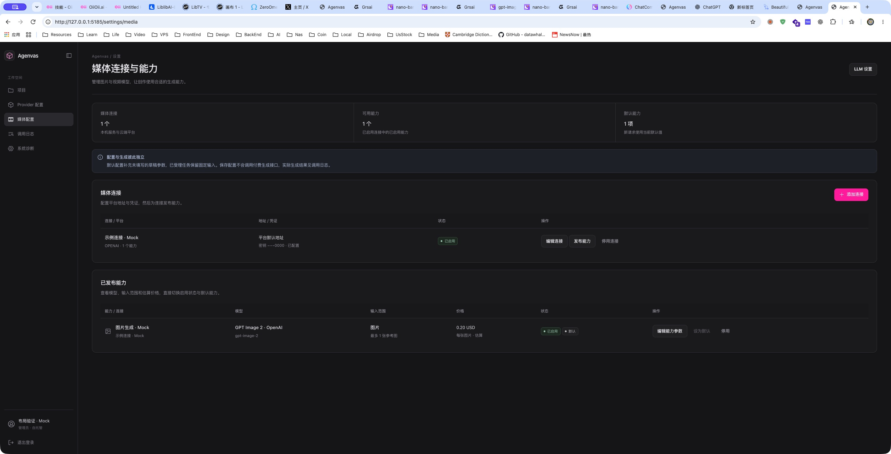
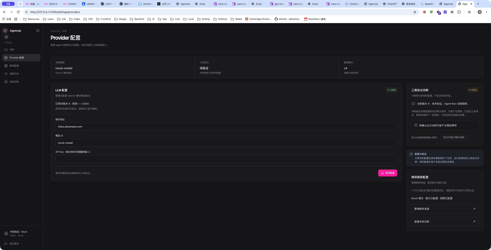
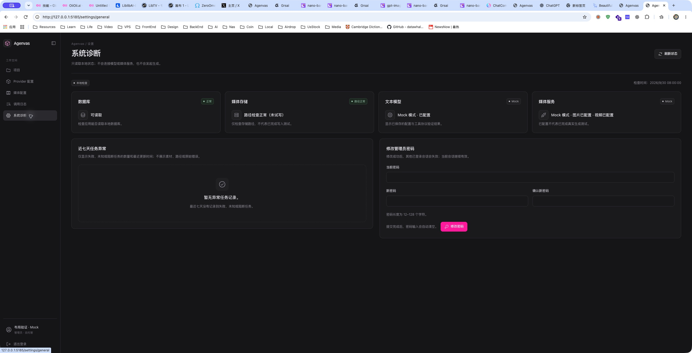
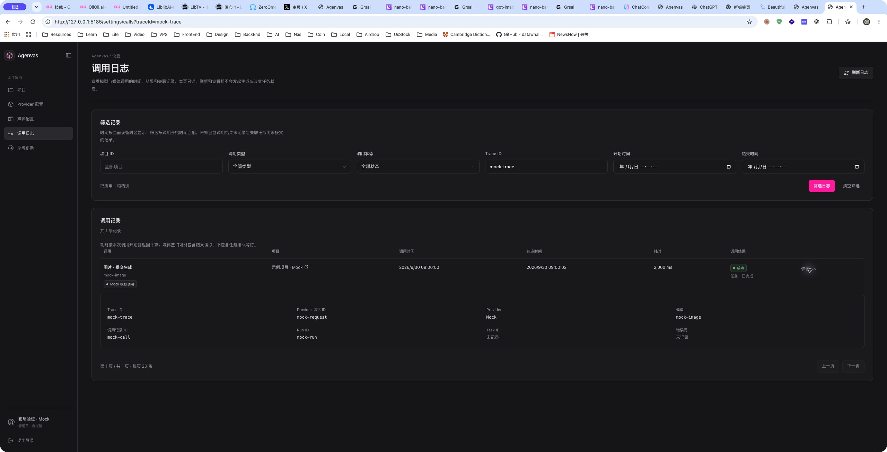
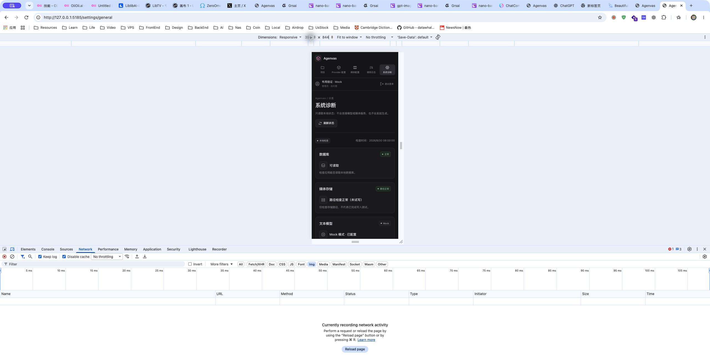
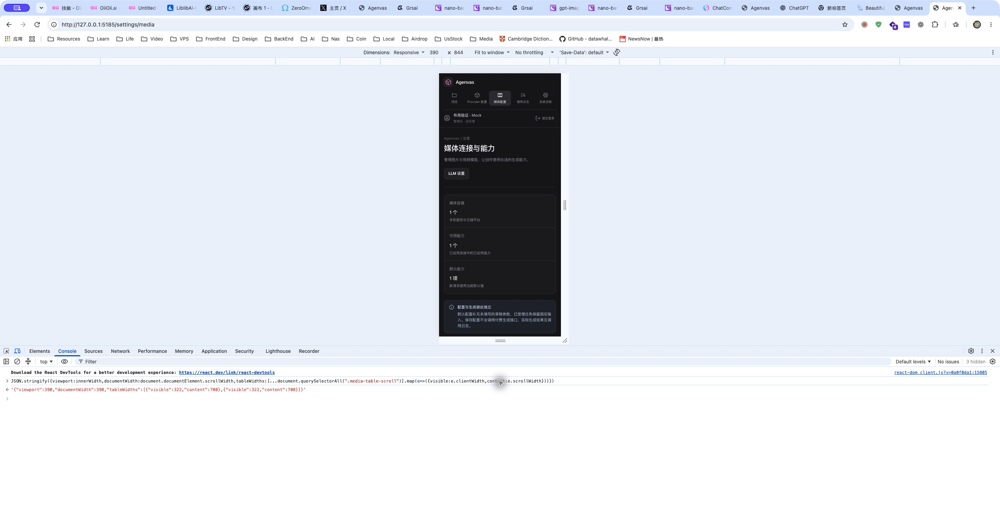

# 后台全宽布局验证

日期：2026-09-30。

## 行为与文件

- `PageShell.css` / `.tsx`、`design-tokens.css`：移除 1280px 主内容宽度上限，侧栏外使用全部空间，桌面边距为 20–40px；页头增加分隔与更紧凑的层级；导航支持折叠、短窗口内部滚动与减少动态效果偏好。
- `LlmSettingsPage.tsx`、`SettingsPages.css`：配置与工具诊断并排；辅助列最大 400px。未保存修改显示提示和显式撤销，撤销清空临时凭据与费用确认，不保存或调用模型。
- `SystemDiagnosticsPage.tsx`：宽屏四张状态卡横排，下方异常与改密并排；窄屏恢复单列。密码组件保持挂载，异步诊断结果不会清空输入。
- `CallLogsPage.tsx` / `.css`：宽屏六列筛选、四列详情，显示已应用筛选数量，行悬停与详情箭头反馈。
- `ProjectsPage.css`：卡片按可用宽度自动增加列数。
- 新增配置撤销与诊断加载保留输入测试；同步设计系统、MVP 规格与开发清单。

本轮没有后端、OpenAPI、数据库迁移或依赖变更。保留工作区原有的其他改动。

## 实际检查

- `vitest run src/shared/ui/PageShell.test.tsx src/features/settings/LlmSettingsPage.test.tsx src/features/settings/MediaSettingsPage.test.tsx src/features/settings/SystemDiagnosticsPage.test.tsx src/features/settings/PasswordChangeSection.test.tsx src/features/settings/CallLogsPage.test.tsx src/features/projects/ProjectsPage.test.tsx`：7 个文件，54 项通过。
- `tsc --noEmit`：通过。
- 对 PageShell、LLM 配置及测试、系统诊断及测试、调用日志执行定向 ESLint（`--max-warnings=0`）：通过。
- `vite build`：通过。
- `git diff --check`：通过。

## 浏览器证据（Mock）

真实页面组件通过临时 Vite 服务加载隔离 Mock GET 数据，所有写入请求均拒绝，不连接真实 Provider。原生 Chrome 窗口宽 2560px：媒体表格、摘要和日志列表铺满右侧；Provider 配置与诊断并排；系统诊断四卡横排。实际修改模型字段、收起导航确认草稿仍在，撤销后恢复 `mock-model`。日志输入 Trace ID 并应用，URL 与“已应用 1 项筛选”同步；展开详情显示关联 ID。

Chrome 响应式工具设置 390×844：诊断卡单列，媒体表格只在局部容器横向滚动。通过控制台只读 DOM 测量，诊断与媒体页面 `innerWidth` 和文档 `scrollWidth` 均为 390；媒体两张表的可视宽度为 322，内容宽度为 700。控制台发现一次已有 favicon.ico 404；没有观察到这些操作的应用脚本错误。这不是完整浏览器自动化或无障碍审计。

临时 Mock 文件、服务和浏览器预览页签在验证后清理。全量测试、后端测试、真实 Provider 调用、触屏/屏幕阅读器、部署均未运行。

