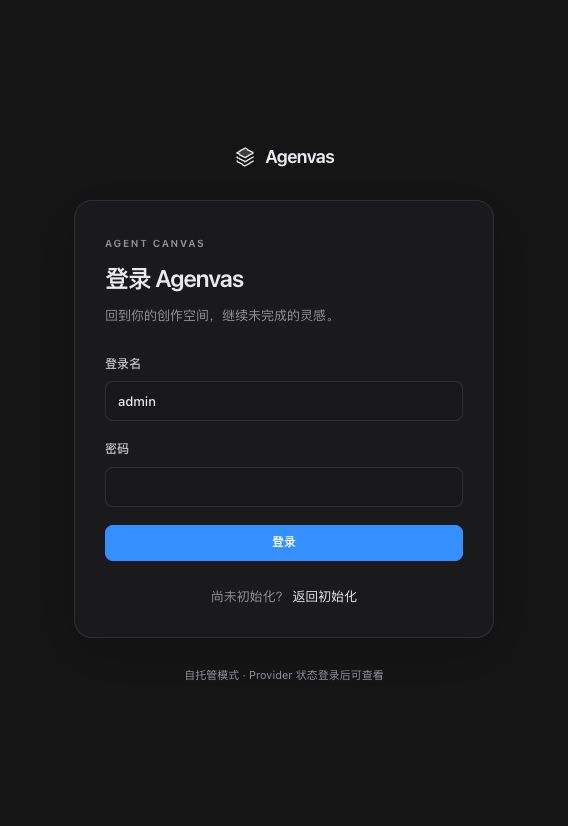
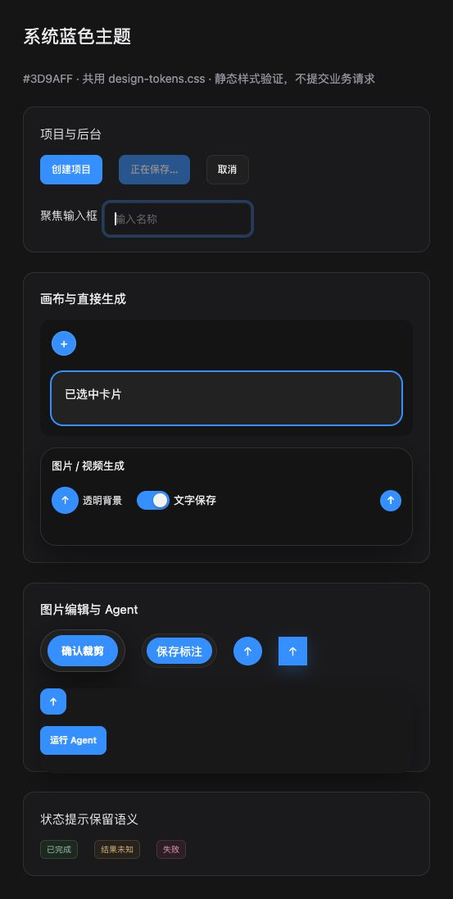

# 蓝色主色统一验证

日期：2026-09-30。

## 实际改动

- 参考图按钮的主填充色取样为 RGB(61, 154, 255)，即 `#3D9AFF`。`shared/ui/design-tokens.css` 是主色唯一入口；悬停、强调文字、浅背景、透明外圈、光晕和焦点使用派生变量。
- 登录、项目、设置和画布的主操作共同消费该主题；清除工作区、媒体/文字生成、Agent、裁剪、智能编辑、打光与标注控件原先的粉色/紫色字面值。卡片选中、键盘焦点、标题编辑、开关和连接反馈也统一。画布网格使用公共边框变量。
- 关系线颜色集中配置，媒体派生线由粉色改为浅蓝色；输入蓝色、输出绿色、引用灰色。删除与执行规则不变。错误/警告/成功、图像温度预览、实际画笔/遮罩与图片引用身份色保留独立用途。
- `pnpm lint` 增加 `scripts/check-theme-colors.mjs`，检查业务 CSS 的品牌范围 hex/rgb/hsl 字面值及主色/焦点变量独立定义。它不扫描 TypeScript 中业务画笔/遮罩/引用数据，也不限制灰度、红色错误和绿/橙状态色。
- 同步公共样式说明、MVP 规格、ADR 0005 与开发清单。没有新增依赖、API、数据库迁移、后端或 Provider 行为；保留工作区原有未提交修改。

## 实际检查

在 `frontend` 执行：

```sh
pnpm lint
pnpm build
pnpm test \
  src/features/auth/LoginPage.test.tsx \
  src/features/projects/ProjectsPage.test.tsx \
  src/features/settings/MediaSettingsPage.test.tsx \
  src/shared/ui/Select.test.tsx \
  src/shared/ui/DropdownMenu.test.tsx \
  src/features/canvas/MediaDraftEditor.test.tsx \
  src/features/canvas/BrushMarkupEditor.test.tsx \
  src/features/canvas/CropPanel.test.tsx \
  src/features/canvas/ContentCanvasCard.test.tsx \
  src/features/canvas/AgentChatCard.test.tsx \
  src/features/canvas/ArtifactCardFrame.test.tsx \
  src/features/canvas/TextGenerationEditor.test.tsx
pnpm test \
  src/features/canvas/ProjectWorkspacePage.test.tsx \
  src/features/canvas/MediaCanvasCard.test.tsx \
  src/features/canvas/canvasRelations.test.ts
```

结果：15 个相关测试文件、181 项测试通过（两批分别为 92 和 89 项）；TypeScript 类型检查、Vite 生产构建、主题检查和 ESLint 零警告通过。根目录 `git diff --check` 通过。

用临时 CSS 文件验证防回退检查：独立 `#3d9aff`、`rgba(61, 154, 255, .3)`、`hsl(210, 100%, 50%)` 和 `--accent: #f00` 均被拒绝；移除临时文件后检查通过。该检查还识别并促成修正连接点阴影遗漏的旧 `rgb(255 27 166 / 22%)`。

## 浏览器呈现

通过本地 Vite 打开真实登录页，读取主按钮计算样式为 `rgb(61, 154, 255)`，前景为 `rgb(255, 255, 255)`，与参考填充一致。

另外建立临时隔离 HTML，只加载项目真实 CSS 和代表性的控件标记，不挂载业务组件、不提交业务请求。核对创建项目、添加卡片、媒体生成、文字保存、裁剪确认、标注保存、智能编辑、打光、Agent 发送/运行十类按钮，计算背景色均为 `rgb(61, 154, 255)`；截图同时展示禁用、输入焦点、卡片选中、开启开关与状态标签。临时 HTML 与 Vite 服务已清理。





## 未验证范围

未运行全量或后端测试，未部署，未调用真实 Provider。未逐项进入所有真实业务页面检查全部悬停、弹窗、触屏及屏幕阅读器呈现；隔离样式预览不能替代完整业务页面验收。
