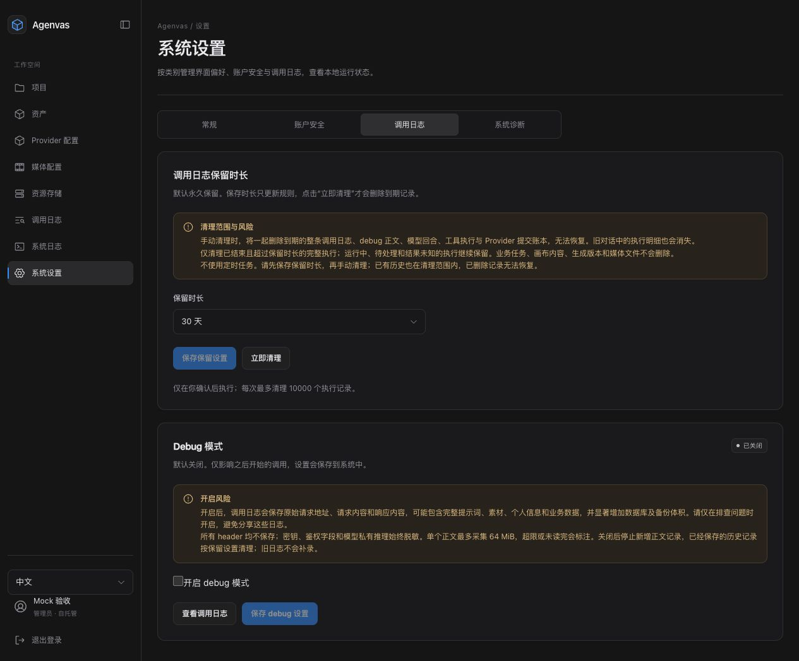
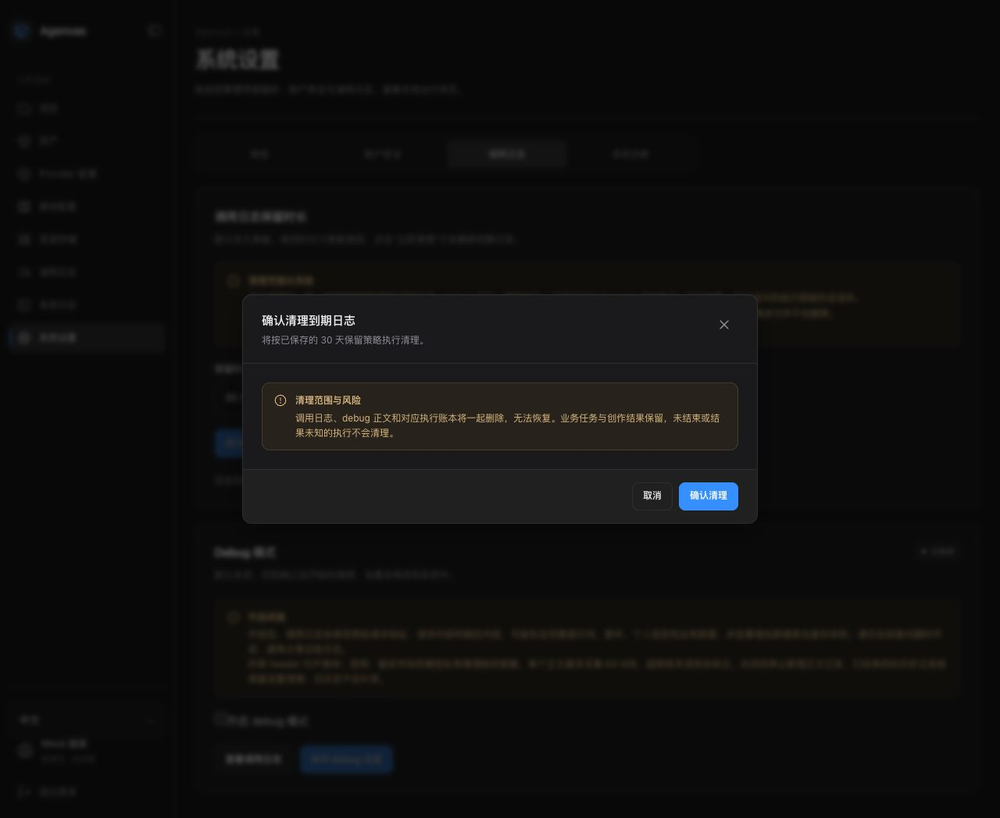
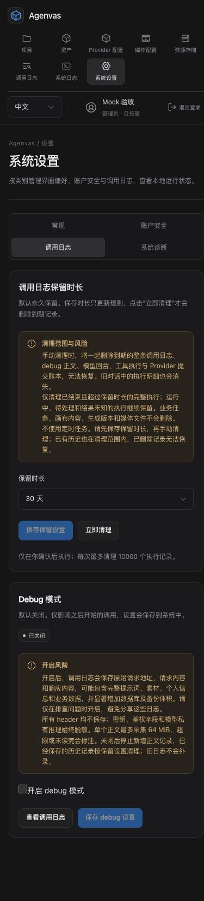

# 调用日志与执行账本保留期

2026-10-01。按照用户最新决策，日志和底层执行账本一起手动清理，业务结果保留，不使用定时任务。实现位于 audit 的 CallLogRetentionService、JooqCallLogRepository，CallLogRetentionScheduler 已删除。LLM 的 ExecutionLedgerRetention 与 Task 的 ProviderAttemptRetention 各自拥有账本删除。前端 SystemSettingsPage 只负责分类，SystemDiagnosticsSection、CallLogRetentionSection、DebugModeSection 与 PasswordChangeSection 分别管理对应内容。

策略默认永久；30 天、90 天与自定义 1–3650 天均需管理员明确保存。GET/PUT `/api/v1/settings/call-log-retention` 使用 no-store、管理员授权、CSRF 与 CAS；遗漏 retentionDays 不等于永久，必须明确传 null。设置失败/冲突保留 UI 草稿，重新读取后使用新版本重试。页内四个 tab 的草稿保持挂载，诊断/日志请求只在对应分类启用；侧栏名为系统设置，既有诊断与 debug 链接分别指向相应分类。

保存设置只更新规则，不触发删除。管理员点击“立即清理”并确认后，POST `/api/v1/settings/call-log-retention/cleanup` 传入已确认的 expectedVersion；服务端在每批策略行锁内校验版本，变更返回 409。接口需要管理员权限与 CSRF，响应 no-store，返回实际清理的执行单位数量 cleanedExecutions 和 batchLimitReached。未保存草稿、永久保留或清理中不可再次发起清理；请求不自动重试。

每次手动请求最多十批、每批最多 1000 个执行单位，达到上限提示用户再次手动执行。每批短事务锁定策略、终态 Run/Task，活动任务锁跳过整个执行。仅 SUCCEEDED/FAILED/CANCELED 执行可清理，完成与最近活动严格早于 `Clock.now - retentionDays`；Run 的全部任务及调用都必须符合条件，UNKNOWN、待处理、过期租约的可恢复执行继续保留。调用元数据、debug 正文、模型回合、工具执行及 Provider 提交账本同事务删除，错误整批回滚；后续批次失败不能恢复之前已提交的删除，前端明确提示结果未确认和手动清理剩余记录。HTTP 幂等、Task/Run 身份和输入/最终结果、用量、创作版本与媒体资产保留。旧对话动作明细和记忆中的工具摘要会消失。未承诺 PostgreSQL 数据文件立即缩小或自动清理既有备份。

## 升级

V71 新增单行保留设置；V72 将清理范围扩展至完整执行历史，移除仅日志删除阶段使用的水位及无用索引。已有 Flyway 文件未修改，已由一次性 PostgreSQL 17.11 迁移库重新生成并提交 jOOQ 源码。本次改成手动执行没有新增迁移或修改数据库模型，TS 已由新增 POST 的 OpenAPI 合约重新生成。新字段默认 null，升级后不自动删历史；已有有限保留策略也只在明确手动执行后删除。现有 debug GET/PUT 结构不变，其历史记录受手动清理策略约束。删除不可恢复，延长保留期不会恢复旧账本投影。

## 实际验证

- 后端 clean 编译后运行 `CallLogServiceTest`、`CallLogRetentionServiceTest`、`ApiI18nTest`、`SecurityI18nTest`：17 项通过。覆盖策略验证、永久/有限/CAS、Clock、批次上限、确认版本及后续批次失败时不自动重试。
- `CallLogPostgresIT`：PostgreSQL 17.11/Testcontainers，16 项通过。新增验证不存在清理 Scheduler Bean、保存不触发删除、手动 POST 的授权/CSRF/no-store/必需版本、永久策略不删除、版本冲突不删除、实际整组删除及再次执行返回零。既有元数据与正文/各类账本同删、业务身份保留、UNKNOWN/边界/近期活动保护、分批、失败回滚、直连任务及仅有旧账本的历史测试保留，并用并发事务验证单个 Task 被锁时跳过整个 Run。
- 前端 `CallLogRetentionSection`、`SystemSettingsPage`：14 项通过。覆盖保存不清理、未保存时不可清理、确认/取消、提交已保存版本、防重复提交、实际数量及上限、失败不自动重试、冲突重新读取再确认、会话过期、分类读取、键盘切换及跨 tab 草稿。
- TypeScript、变更文件 ESLint、四语言资源和主题颜色检查通过；Vite 生产构建通过，仍有既有大 chunk 提示。
- 浏览器使用明确标注 Mock 的 HTTP 预览夹具，检查手动清理按钮、确认弹窗与风险说明、桌面及 390×844 窄屏（实际内容宽 375，页面宽与内容宽相同）无水平溢出。截图中 30 天仅为 Mock 已保存夹具；打开确认后取消，未执行真实清理、未改实际系统保留策略，真实默认仍为永久。

未运行全量测试、真实 Provider 调用、生产数据库清理或长时间容量测量。浏览器预览不代替 PostgreSQL 持久化证据。
