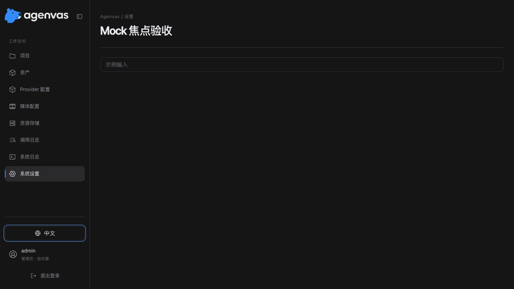

# 焦点样式调整（2026-10-02）

截图中的粗外圈来自 shadcn 3px ring 与旧页面 2px outline 叠加。公共 primitives 统一使用 `ui-focusable` 的单层 1px `:focus-visible` 轮廓，宽度/偏移集中在 design-tokens；旧页面和画布焦点规则沿用相同变量。旧输入样式不再叠加到 shadcn Input/Textarea 上。未改变事件、焦点恢复、表单或 API 行为。

实际检查（frontend）：

```sh
pnpm test src/shared/ui/PageShell.test.tsx src/shared/ui/Select.test.tsx src/shared/ui/Dialog.test.tsx
pnpm lint
pnpm build
```

3 个文件、14 项测试通过；主题/四语言/ESLint 检查通过，TypeScript 与生产构建通过。构建仍有超过 500 kB 的既有分块提示。`git diff --check` 通过。全量及后端测试未运行。

隔离 Mock 浏览器用真实 PageShell 验证 Tab 到语言按钮：计算样式 outline 为 1px，offset 为 2px，没有额外的蓝色 ring 阴影；关闭语言窗口仍恢复触发器焦点。只进行侧栏的浏览器视觉验收，未逐一验收全部画布控件。临时入口、页签与服务已清理。


