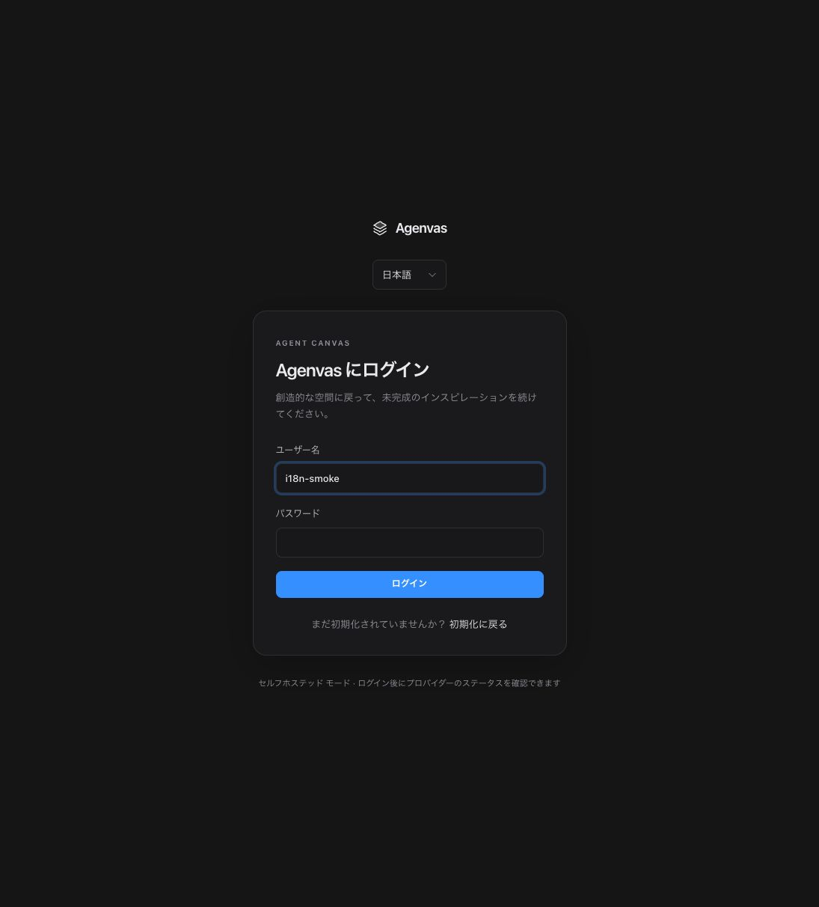

# 四语言配置验证（2026-10-01）

已实现英语、中文、俄语、日语的共享页面文案与语言选择。前端四份词典各有 1,675 条消息，后端本地资源包含 664 条完整消息模板；不复制页面，不增加依赖、账号语言 API 或数据库迁移。入口、偏好、格式化、插值、API 协商和维护规则见 [配置说明](../i18n.md) 与 [ADR 0027](../adr/0027-shared-interface-localization.md)。

涉及 `frontend/src/shared/i18n`、现有 auth/projects/library/canvas/settings 组件与 shared API/UI；后端新增 `shared/i18n`，迁移全部 154 个公开异常构造点及其详情工厂（56 个原有 Java 文件），采用资源键与参数；统一错误处理器、Asset 的 416、资源转存失败及 RunningHub 导入警告使用协商语言。Bean Validation 共用 MessageSource，原始字符串异常在编译期被拒绝。`contracts/openapi.yaml` 声明可选 Accept-Language 参数与本地化响应头，TypeScript 从合约重新生成；没有手改生成类型、Flyway 或 jOOQ 文件。

实际运行的检查：

- `pnpm install --frozen-lockfile`：通过，未修改依赖与锁文件。最终前端工具通过本机 Node 24.12.0 直接调用。
- `node node_modules/openapi-typescript/bin/cli.js ../contracts/openapi.yaml -o src/shared/api/schema.ts`：通过。
- `node node_modules/typescript/bin/tsc --noEmit`：通过。
- 主题检查、`node scripts/check-i18n.mjs` 和 ESLint `--max-warnings=0`：通过。i18n 检查资源键、占位符数量、登记的源消息和中文界面硬编码。
- 定向 Vitest 第一批：35 文件 / 282 项通过，覆盖新增 i18n、认证、项目、设置、资源库、共享 UI 与受影响的画布表单/卡片。第二批：16 文件 / 102 项通过，补验音频提示词、标题、显示设置、版本编辑、UNKNOWN、卡片交互，并重跑增加浏览器偏好检测用例后的 i18n 测试。两批包含重复 i18n 测试，不代表全量套件。
- 初次实现阶段：`./mvnw -Dtest=ApiI18nTest,RequestCorrelationFilterTest,AssetControllerStreamingTest test`，Java 21 编译及 9 项测试通过。验证质量权重、地区匹配、默认回退、四语言错误、字段错误、异常脱敏、MVC 之前的错误映射、关联 ID 与素材流行为。MockMvc / 假服务单测，不代表生产部署或真实 Provider。
- `node node_modules/vite/bin/vite.js build`：通过。仍有超过 500 kB 的 chunk 提示，当前主入口约 834 kB（gzip 256 kB），画布 chunk 约 554 kB（gzip 162 kB）；没有通过提高阈值屏蔽提示。
- `git diff --check`：通过。

浏览器使用本地 Vite 的 `/login` 实际切换中文 → 俄语 → 英语 → 日语，检查标题、字段、按钮和语言控件。切换时可见测试登录名 `i18n-smoke` 保留；刷新后日语偏好恢复。没有提交登录、改变密码或调用生成。日语页面证据：

全量前后端测试、PostgreSQL 集成测试、生产部署、后台及画布的四语言浏览器视觉巡检、真实 Provider 调用：未运行。长篇专业文案以机器翻译建立，主要入口及安全/任务提示已校正，俄语与日语仍需母语审校。用户内容、提示词、Provider 参数值与审计正文保持原值；已知动态公开异常保留参数化具体说明，未知实现异常或无法识别的旧转存说明使用安全通用文案。

后端补全验证（同日）：

- `./mvnw -Dtest=ApiI18nTest,MessageCatalogTest,LocalizedResponseTest,SecurityI18nTest,RequestCorrelationFilterTest,AssetControllerStreamingTest,VideoGenerationParametersTest,ImageGenerationParametersTest,RunningHubImportServiceTest,RunningHubDefinitionTest,MediaCapabilityConfigurationTest,IdentityServiceTest,AgentTurnFailureCodeTest test`：44 项通过，Java 21 生产源码及测试源码编译通过。真实 Video 参数校验器的动态详情在四语言中保留字段名；认证与 CSRF 使用实际安全处理器；资源和导入 Controller 使用假服务，不调用数据库或付费 Provider。
- `./mvnw -Dtest=ReadToolServiceTest,ProjectEventHubTest,ArtifactContentValidatorTest,CallLogServiceTest,ShutdownGateTest,RunningHubAdapterTest,RunningHubClientTest,AutoDlWorkflowsTest,StorageSettingsServiceTest,ObjectStorageClientTest,AuthenticationAttemptLimiterTest,CredentialCipherTest,LlmEndpointPolicyTest,SystemLogBufferTest test`：62 项通过。覆盖本次迁移影响的现有校验、工具、存储、协议和配置单测；未运行全量套件。
- `MessageCatalogTest` 直接检查基础与四语言资源键、占位参数以及所有生产消息调用的参数数量；编译过全部公开异常构造点。代码中剩余中文字符串为原始业务内容、固定协议值、生成演示/提示词或审计正文，不再用于公开异常标题、详情和校验注解。
- 两处 PostgreSQL 工具权限测试改为断言稳定错误码与消息键；没有执行这些集成测试，不能据此声称 PostgreSQL 回归通过。

- 补充真实 Setup DTO 自定义校验后，`./mvnw -Dtest=ApiI18nTest,MessageCatalogTest,LocalizedResponseTest,SecurityI18nTest test`：12 项通过（包括重复测试），四语言字段说明不回显密码或拒绝值。
- 同步合约描述并重新生成 TypeScript 后，前端类型检查、主题检查、i18n 检查与 ESLint 再次通过；定向复验 i18n、资源页/保存/参考/文字保存和媒体设置：6 文件 / 33 项通过。此前生产构建成功；本轮没有重跑全量测试。
