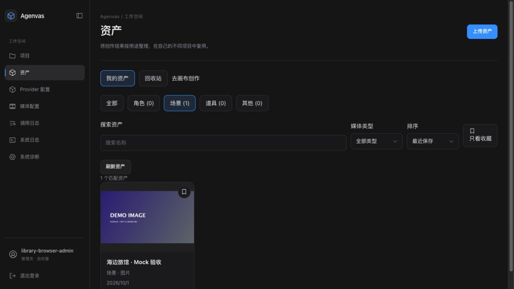
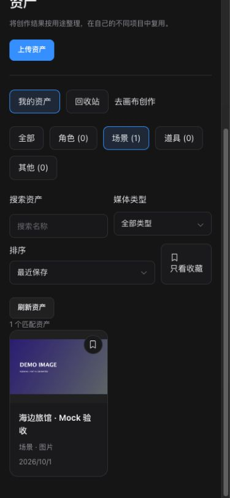

# #24 个人资产库实施与验收

日期：2026-10-01。基准提交 `7164253`，分支 `codex/personal-asset-library`。用户确认账号级跨项目复用、真实 PostgreSQL + HTTP 与 React 交互测试边界，以及上述审查基准。

## 实际行为

新增 `/library` 与资产导航；角色、场景、道具、其他和四类创作类型分别筛选。画布“保存为资产”固定选中的不可变版本；文字编辑先保存 CAS，失败保留输入；媒体草稿空态拒绝。资产独立复制媒体，来源项目文件清理不破坏资产。导入创建目标项目独立内容与首个节点结果、空白媒体草稿；图片/音频参考原子导入并加入既有精确输入，不自动生成。

上传、分类/改名/收藏、搜索/分页/计数、详情、回收站/恢复/确认永久删除已实现。保存/上传/导入/参考均返回 202；命令成功后才显示完成，同键异参 409，版本冲突保留输入。所有内容、缩略图、命令与元数据按账号重新鉴权。转存固定输入及文件 pin、稳定归档 ID、短事务租约/fencing；清理记录持久化。

## 文件与升级

后端新增 `library` 模块与资产存储应用边界；复用产物、画布、媒体草稿及能力校验应用服务。迁移 V67–V70 新增五张 library 表及完整性约束；jOOQ 由独立 PostgreSQL 17.11 重新生成。OpenAPI、生成 TS、图片/视频 JSON Schema 同步增加只读 `LIBRARY_IMPORT`；普通 Artifact 写入拒绝伪造。同步 CONTEXT、规格 6.14、设计、ADR 0026、开发清单及备份范围。无依赖变更。

前后端需同版本部署，升级前备份数据库与完整文件卷（包含 `library/` 和命令 pin）。既有迁移未修改，新增迁移不删除项目或既有媒体。真实旧部署升级/回滚及完整库备份恢复演练未运行。

## 已运行检查

- 新后端功能：`LibraryPostgresIT` 1 项、`LibraryRecoveryPostgresIT` 8 项，真实 PostgreSQL 17.11 + HTTP；保存、独立字节/Range、上传真实解码、跨项目导入、引用、元数据 CAS、回收站、权限 404/未登录 401、来源与库删除隔离、固定选中 v2、文字 CAS、非法来源、恢复与分页均通过。
- 并发测试：两个 HTTP 命令同一来源版本只保存一个条目；同键重放相同命令、异参冲突；参考受理后目标草稿变化整笔回滚且无新增项目事件。
- 恢复测试：数据库租约过期与已安装文件模拟崩溃边界，恢复同一命令；目标路径被阻挡导致失败，解除后明确重试成功。没有实际模拟操作系统 ENOSPC 或 kill -9 资产复制进程。
- 前端定向回归最初 9 文件 125 项通过；最终 5 文件 35 项通过，包括 5 项新增公开 React 交互测试。
- 全量只运行一次：`./run-tests.sh`。前端 50 文件 / 380 项通过；后端单元 180 项无失败，1 项依赖本地 Depth Anything 权重的 opt-in 测试跳过；后端集成 100 项出现 2 失败 / 1 错误。
- 全量失败定位：旧 `ComfyUiAcceptedCrashPostgresIT` 夹具缺少冻结 `mediaInput.images/audios`，子进程抛 IllegalArgumentException；旧 `ComfyUiVideoPostgresIT` 断言 schemaVersion 2，而基准实现已为 3；新库 Worker 在旧测试容器关闭后未捕获数据库异常。补齐夹具/断言与轮次错误处理。原两项失败已在修复前定向重现，修复后 4 个相关 IT 类共 11 项通过，内容校验单元 3 项通过（定向 Maven verify BUILD SUCCESS），未再次运行全量。
- OpenAPI 生成、TypeScript strict、ESLint、Vite 生产构建通过；构建保留既有大分块体积警告。jOOQ 在本轮独立空库迁移到 V67 后生成成功。

## 未验证与范围限制

真实 Provider/LLM 未调用。库功能测试不需要生成费用；既有媒体回归使用假 ComfyUI。其他账号测试使用另一已认证 UUID 身份，当前产品仍为单管理员，未执行两个实际用户的登录流程。跨进程清理竞争、资产库专属 SSE 断线补发、操作系统 ENOSPC、生产规模与真实升级/备份恢复未验收；完成项与专项门禁分别记录在开发清单。

浏览器验收与双轴审查结果见下文。

## 双轴审查与修复

按 code-review 技能，独立子代理以 `git diff 7164253...HEAD` 进行 Standards / Spec 审查。Standards 3 项：完成后读取草稿可能绕过 CAS、单条清理失败阻塞队列、裸值常量；Spec 2 项：同一 CAS 风险、Escape/外部点击绕过转存关闭保护。全部修复：读取版本必须等于命令 `draftVersion`，保留并发本地输入；统一所有关闭路径并覆盖完成后读取阶段；V67 为清理任务增加 nextAttemptAt 和到期索引，失败延迟 30 秒后重试，其余任务继续处理；提取命名常量。

新增参考并发读回归先失败后通过，新增文件清理阻塞回归先失败后通过。最终资产库 PostgreSQL 测试 10 项、内容校验 3 项通过；对应前端 2 文件 33 项通过，包括参考并发与关闭保护新增测试。没有再次运行全量。

## 隔离 Mock 浏览器验收

使用本轮独立 PostgreSQL、文件目录与服务端口，未修改已有 Compose 实例。实际登录临时账号，创建来源/目标项目；Mock 图片生成后固定节点 v1，保存为“海边旅馆 · Mock 验收 / 场景”，资产页显示完整分类计数与缩略图；详情导入目标项目成功，画布只有一个独立节点、空白提示词与参考；通过“从我的资产选择”成功添加精确 v1 参考，没有额外画布节点、没有运行生成。

桌面分类页及 390 × 844 窄屏网格/详情已检查；窄屏 document.scrollWidth=390、dialog.width=374，没有页面横向溢出。截图使用明确标注的 DEMO IMAGE，与真实 Provider 无关。

验收过程曾因构建替换正在运行的 JAR 导致临时实例类加载错误；已改用独立 JAR 副本重启，仅在该临时库注入租约过期，原保存命令恢复成功且只有一个资产条目。这是本地验收运行方式错误，不作为真实断电/ENOSPC 压测证据。临时服务、文件与数据库在验收后清理。

复审继续核对同一关闭保护项，补齐模型/参数弹层切换与整个编辑器卸载：转存进行中 togglePopover 不切换，编辑器关闭只保存本地 recovery、不提交与受理参考竞争的旧 CAS。按钮切换与卸载测试均先失败，修复后最新 4 文件 110 项通过；类型检查、lint、生产构建再次通过。Standards 原 3 项复审已确认解决；Spec 原 2 项复审已确认全部解决，无剩余发现。临时实例与本轮数据库容器已停止并删除，保留验收截图与文本记录。

## 合并 main 复验（2026-10-01）

合并目标为 `a26f82c`，保留对象存储、AutoDL、RunningHub 和画布显示设置。main 已占用 V64–V66 / ADR 0023–0025，因此将本分支尚未发布的个人资产迁移从 V64–V67 顺延到 V67–V70，ADR 改为 0026，规格改为 6.14。上文原测试的 V67 等编号为当时分支历史编号；清理重试迁移在合并结果中为 V70。已有 main 迁移及其校验和保持不变。前端冲突合并保留 RunningHub 动态表单、AutoDL 预检及资产参考 CAS/关闭保护。

项目资源归档复用 main 的配置存储路由：从云端保存资产会先鉴权、按原连接物化验证后建立账号独立 pin；账号资产仍位于 `library/` 本地卷，导入目标项目按当前配置归档。新增真实 PostgreSQL + HTTP / 明确标注的假对象存储回归，覆盖云端来源删除后账号资产仍可读取、云端跨项目导入、受理参考后的草稿冲突与失败副本清理、资产删除后 READY 导入仍可读取，并断言网络不在业务事务内。回归先失败：失败副本清理仅接受本地对象键，留下云端文件。修复后由存储边界核对本地/云端精确项目归属，先检查原件和缩略图，再清理未注册内容；READY 元数据存在时拒绝删除。

实际定向检查：

- 后端 `ArtifactContentValidatorTest`、`ConfiguredAssetStorageTest`、`ObjectStorageClientTest`、`StorageSettingsServiceTest` 共 15 项通过；`LibraryPostgresIT`、`LibraryRecoveryPostgresIT`、`ObjectStoragePostgresIT`、`AutoDlVideoPostgresIT`、`RunningHubPostgresIT` 共 20 项通过，Maven BUILD SUCCESS。
- 前端 9 个文件共 75 项通过：保存窗口、资产页、参考选择、文字 CAS、媒体草稿编辑、项目画布、媒体上传、RunningHub 表单与存储设置。
- OpenAPI TS 重新生成、TypeScript strict、全前端 lint、Vite 构建通过；仍有既有 >500 kB 分块提示。jOOQ 在独立 PostgreSQL 17.11 将 69 个迁移应用至 V70 后重新生成，输出与自动合并源码一致。
- 另一隔离数据库先迁移至 main 的 V66，再插入测试身份/项目和设置版本标记，应用 V67–V70。Flyway 校验并成功追加 4 个迁移，断言项目名称、版本、事件序号及存储设置版本保留，5 张 library 表存在。

本轮未再次运行全量测试、浏览器端到端、真实云存储/付费 Provider 或生产部署；隔离数据库迁移检查不等于旧部署 Compose 升级或完整备份恢复验收。
