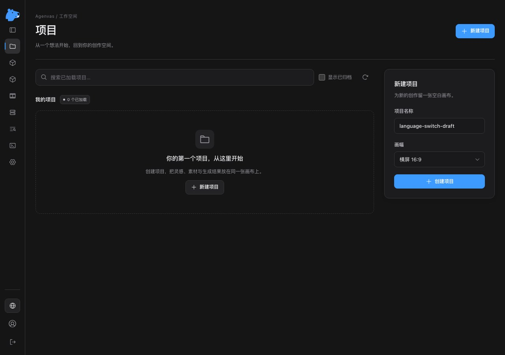
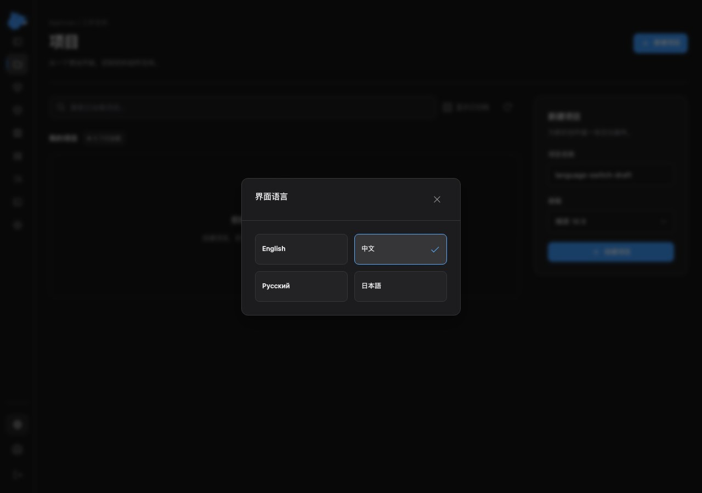

# 折叠导航语言控件（2026-10-01）

按用户反馈，将语言下拉框改为地球按钮打开四语言选择窗口。桌面侧栏展开时显示当前语言原名，折叠到 64px 时只显示图标，提示与无障碍名称保留当前语言；手机顶部导航恢复语言名称。选择立即生效并关闭窗口；本地偏好保存失败则继续显示窗口、当前选择和错误，再次点击可重试。关闭支持 Esc、Tab 焦点限制与回到触发器，语言切换保留当前页面及草稿。

改动涉及共享 `LanguageSelect`、`PageShell` 和对应测试；公共 `Dialog` 增加紧凑尺寸和可省略页脚，视觉集中在 `PageTheme.css` / `Dialog.css`，移除旧全局下拉框样式。所有入口复用同一控件，没有复制页面、增加依赖、修改 API / 词典 / 后端或数据库迁移。规格、ADR 0027、i18n 维护说明和开发清单同步更新。

检查使用 Node 24.12.0，从 `frontend` 运行：

- 新增 `PageShell` 折叠语言入口回归，修改前单独运行失败：找不到语言按钮。修改后覆盖四语言原名、当前选择、折叠状态、草稿保留、关闭与焦点恢复。
- `node node_modules/vitest/vitest.mjs run src/shared/ui/PageShell.test.tsx src/shared/i18n/i18n.test.tsx src/features/auth/LoginPage.test.tsx src/features/auth/SetupPage.test.tsx src/features/settings/MediaSettingsPage.test.tsx src/features/settings/SystemDiagnosticsPage.test.tsx`：6 文件、41 项通过。包含浏览器存储受限后重试、其他标签页语言同步、登录输入保留及媒体模态框回归。jsdom 未实现原生 `showModal()` 聚焦，Esc 单元测试直接向 dialog 发送键盘事件；真实焦点行为由下述 Chromium 检查覆盖。
- `node node_modules/typescript/bin/tsc --noEmit`、主题检查、i18n 检查和 ESLint `--max-warnings=0`：通过。
- `node node_modules/vite/bin/vite.js build`：通过。仍有既有入口/画布 chunk 超过 500 kB 的提示，未屏蔽。
- `git diff --check`：通过。

真实 Chromium 使用本地 Vite `/projects`，仅拦截 GET 会话、初始化状态与项目列表，返回标记的 Mock 用户与空列表；没有调用实际业务 API、创建项目或进行 Provider 请求。检查结果：

- 1280×900 下侧栏折叠宽度 64px，按钮宽度 39px，左右边界在导航内，语言文字隐藏；展开后恢复名称。
- en / zh / ru / ja 的选中状态、文档语言、本地存储与无障碍名称一致；同一个项目名称输入节点保留 `language-switch-draft`。
- 原生窗口中的 Tab / Shift+Tab 循环、Esc 关闭与焦点恢复通过。
- 390×844 和 320×844 下，窗口和入口按钮在视口内，窗口没有横向溢出。浏览器未捕获脚本错误。

折叠导航：

四语言窗口：

展开导航与手机窗口另见 [展开状态](i18n/language-button-expanded.jpg) 和 [手机状态](i18n/language-picker-mobile.jpg)。临时浏览器检查脚本和 Vite 服务收尾清理，不作为生产入口。

本轮未运行前端全量、后端测试、部署或真实 Provider；上述浏览器 API 为 Mock。后端此前的全量结果见 [i18n 验证记录](i18n-2026-10-01.md)。

与 main 的品牌标识及调用日志更新整合后补验：保留 `Dialog` 的自定义 className、嵌套窗口滚动锁和键盘事件隔离，同时加入紧凑尺寸与可省略页脚；没有覆盖 main 的新标识与日志页面。类型检查、主题/i18n 检查、完整 ESLint 与生产构建再次通过；上述 6 个文件，加 `Dialog.test.tsx`、`CallLogsPage.test.tsx`、`CallDebugDetails.test.tsx`、`FormattedCallExchange.test.tsx`，共 10 文件 / 65 项通过。真实 Chromium 的四语言、草稿、Tab/Esc、焦点与手机宽度检查再次通过，本文截图更新为整合后的页面。
