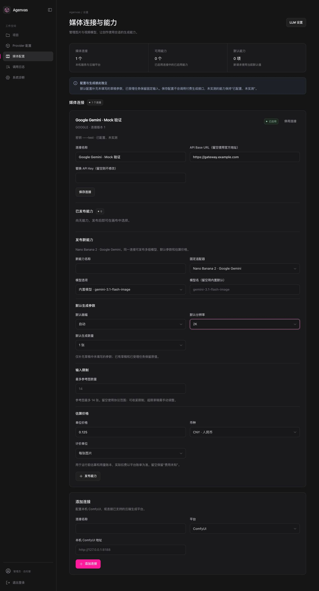
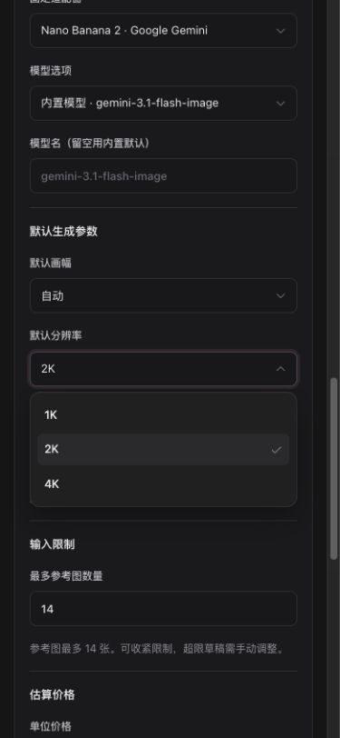

# 媒体能力配置补全验证（2026-09-30）

## 行为

- 平台下拉框显示 `Google Gemini · Nano Banana 2`；能力适配器显示 `Nano Banana 2 · Google Gemini`，保留原适配器 ID。OpenAI/Google 提供内置模型及自定义兼容模型选项，模型长度与后端 120 字符限制一致。
- Google 与 OpenAI 的 API Base URL 可创建、回显与保存，Google 保存不再错误提交 `origin:null`；替换 Key 留空仍保留凭证。Seedance 的模型与地址按现有固定协议只读展示。
- 发布与编辑复用 `CapabilityConfigurationFields`。图片提供默认画幅、分辨率、数量和受支持的背景/画质；视频提供默认画幅与时长。支持收紧视频时长和参考图数量，留空沿用固定协议范围。配置修改使用现有 CAS 和发布幂等键。
- 价格使用十进制字符串、CNY/USD、按图片/视频/秒计价。空价格保留未知，显式零表示零估算。草稿运行按钮显示整批图片或视频的精确估算；自定义模型名称在画布中正确显示。
- 服务端默认值只补未填写字段，显式草稿值优先；时长、引用数量和受支持参数服务端校验。任务固定有效参数、能力版本及 `mediaPricing`。账本预留、结算和取消释放沿用固定价格，实际费用仍为空；本地操作继续为已知零。

## 文件及合约

主要涉及 `MediaSettingsPage`、公共配置字段与适配器展示目录、`MediaDraftEditor`、`shared/mediaPricing`，以及后端 `MediaCapabilityConfiguration`、`MediaCapabilityService`、设置 Controller、`DirectMediaTaskService` 和 `UsageService`。

`contracts/openapi.yaml` 补上既有实现遗漏的 `model` 字段，增加默认参数/限制/价格声明并修正 Google origin 描述；TypeScript 通过 openapi-typescript 7.13.0 重新生成。沿用既有版本 JSON 与账本字段，无 Flyway/jOOQ 变更。决策见 [ADR 0019](../adr/0019-media-capability-defaults-limits-and-pricing.md)。

## 实际检查

- 新增 Nano Banana 可识别选项/API 地址断言，先运行原实现得到失败，再修复为通过。
- 前端 `MediaSettingsPage.test.tsx` 12 项通过：包含 Google 地址保存、保留 Key、默认参数/价格/引用限制保存、ComfyUI 默认时长/范围与按秒价格，以及现有 CAS、草稿保留、幂等发布路径。
- `MediaDraftEditor.test.tsx` 28 项通过，包含配置默认值、四张批次精确估算与自定义模型名称展示。
- `mediaPricing.test.ts` 2 项通过：十进制批次/秒计价、未知价格及显式零。
- 后端单元：`MediaCapabilityConfigurationTest` 6 项、`MediaAdapterRegistryVideoModesTest` 2 项、`UsageMediaPricingTest` 3 项通过；覆盖协议边界、非法价格/单位、默认值、估算结算/未知/本地零。
- 真实 PostgreSQL：`MediaCapabilityConfigurationPostgresIT`、`MediaCapabilitySettingsPostgresIT`、`GoogleNanoBananaPostgresIT`、`DirectMediaGenerationPlacementPostgresIT` 各 1 项通过；`MediaCapabilityPostgresIT` 4 项通过。前两项检查真实版本持久化、旧绑定限制、默认参数、受理价格与取消释放；Google 使用本地假服务，验证正常归档与 UNKNOWN 不重提。
- TypeScript、指定文件 ESLint 零警告、Vite 生产构建和 `git diff --check` 通过。
- 浏览器使用真实页面组件和临时 Mock 数据验证；390×844 下菜单可选、价格可输入，无水平溢出（viewport=390，scrollWidth=375）。未写入用户配置或调用外部生成接口。临时 harness、浏览器页及 Vite 进程在验证后清理。

## 浏览器证据（Mock）

完整窄屏页面：[Mock 截图](media-capability-configuration/nano-banana-mobile-mock.png)。

## 限制

没有运行全量测试，没有真实 Google/OpenAI/Ark 付费调用，没有部署。管理员价格只是静态单价估算，未接供应商报价/实际账单，也不按分辨率、质量或参考图数自动获取分层价格。同协议自定义模型仍须部署者自行验证；本轮未增加任意适配器或动态模型发现。
