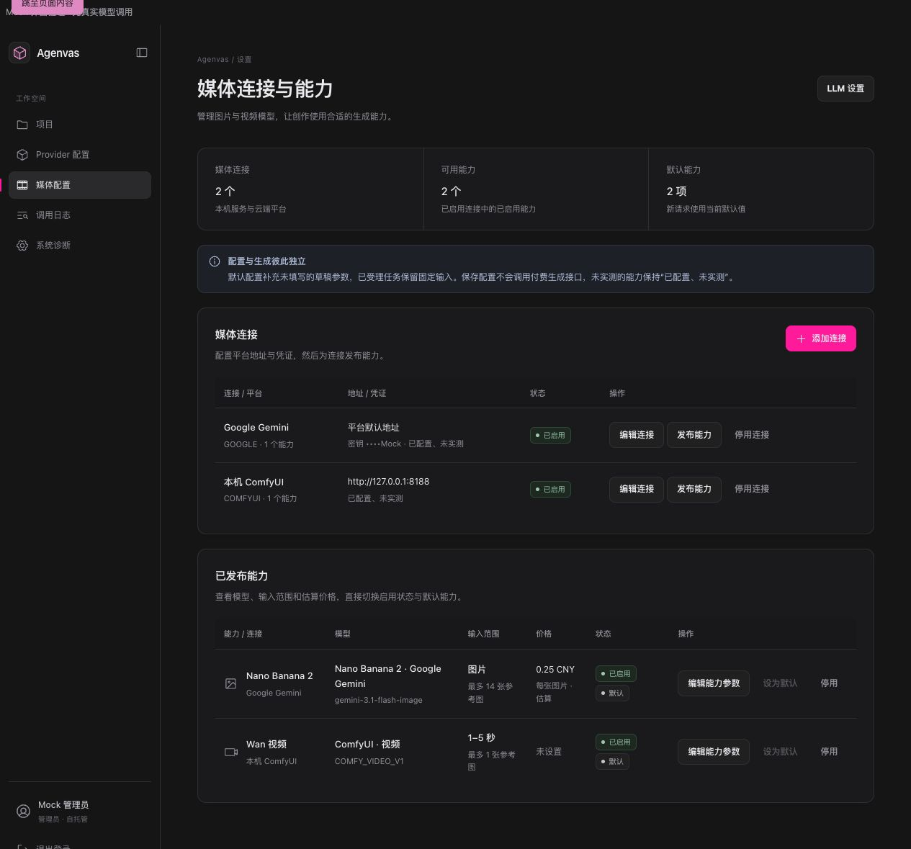
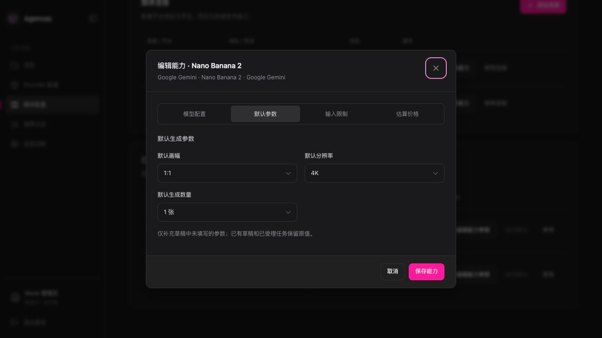
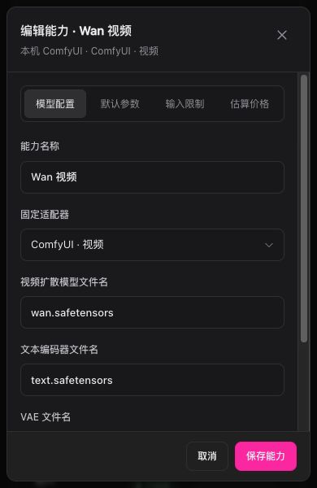

# 媒体设置表格与短模态框验证

日期：2026-09-30。

## 实际行为

媒体连接与已发布能力使用两张表格，列表不展开编辑表单。连接表展示平台、地址、掩码凭证、状态和编辑/发布/启停；能力表展示所属连接、模型、输入范围、估算价格、状态和编辑/默认/启停。本地图片处理仍由系统管理。

添加或编辑连接使用短窗口；发布或编辑能力共用四个页签：模型配置、默认参数、输入限制、估算价格。窗口最高 680px，并受动态视口约束；固定标题和操作栏，只有内容滚动。小屏表格在区域内横向滚动，页面没有额外横向溢出。

切换页签保留全部参数。关闭窗口保留当前页面的草稿，保存成功后关闭；失败保留输入，后台版本更新要求显式载入，CAS 仍固定草稿起始版本。保存中禁用关闭。Tab/Shift+Tab 在窗口内循环，关闭后恢复触发按钮焦点；Escape 先关闭下拉菜单，再关闭窗口。隐藏页签校验失败时返回对应页签并聚焦必填项。

另外修正了 Google 新建连接丢弃自定义 API 地址的问题；编辑连接路径已支持相同地址。

## 文件与边界

- `frontend/src/features/settings/MediaSettingsPage.tsx` / `.css`：两张表、行操作、连接编辑及分区能力表单。
- `frontend/src/features/settings/CapabilityConfigurationFields.tsx`：三个参数分区的共用字段。
- `frontend/src/shared/ui/Dialog.tsx` / `.css`：公共窗口、固定操作栏、公共页签样式、焦点和滚动处理，继续消费集中设计变量。
- `frontend/src/shared/ui/Select.tsx`：模态框内选项面板挂载到所在 dialog，避免原生模态层隔离阻断选项点击。
- `frontend/src/features/settings/MediaSettingsPage.test.tsx`：更新表格与模态框交互测试，新增页签、关闭、草稿保留、焦点循环、必填项返回和 Google 新建地址检查。
- 同步 `docs/frontend-design-system.md`、`docs/MVP-SPEC.md`、`docs/DEVELOPMENT-CHECKLIST.md`。

本轮没有后端、OpenAPI、数据库迁移或依赖变更。

## 实际运行的检查

- `vitest run src/features/settings/MediaSettingsPage.test.tsx src/shared/ui/Select.test.tsx`：2 个文件，21 项通过。
- `tsc --noEmit`：通过。
- 对上述修改的 5 个 TS/TSX 文件执行 ESLint，`--max-warnings 0`：通过。
- `vite build`：通过。
- `git diff --check`：通过。

使用真实页面组件和显式 Mock 数据，在浏览器验证 1280×720 桌面、390×844 手机和 390×600 短屏。桌面能力窗口约 507px 高；短屏视频编辑窗口为 584px，内容区 441px、可滚动内容 580px，固定操作栏完全在视口内。实际点击统一下拉菜单选择 4K，Mock 保存完成；隐藏 checkpoint 必填项的发布校验返回模型配置页签，未提交请求。焦点循环已在真实浏览器确认，检查期间没有捕获到浏览器警告或错误。

临时 Mock 页面、测试端口和浏览器页签已清理。全量测试、后端测试、真实 Provider 调用均未运行；本轮界面证据不代表真实供应商生成或计费验收。

## Mock 截图

## Google 图片接口格式说明

2026-09-30 后续：Google 连接列表显示当前 Gemini v1/v1beta 请求格式；新建/编辑连接的 API 地址字段关联可访问的说明块，输入地址时同步更新格式说明，支持带代理前缀和尾部斜杠的 v1beta 地址。说明覆盖裸主机/留空默认 v1、服务商文档优先、API Base URL 与完整生成路径的区别，以及 grsai `/v1beta` 配合 `nano-banana-2-lite` 的已验证示例。能力模型配置旁说明接口版本与模型名分开，不新增接口版本字段、请求模板或自动探测。

涉及 `GoogleImageConnectionHelp.tsx`、`MediaSettingsPage.tsx`/`.css` 与原页面测试。`MediaSettingsPage.test.tsx` 15 项通过，覆盖新建连接默认说明、编辑中 v1→v1beta 的即时显示、代理前缀/尾部斜杠、API 字段关联说明、保存后列表格式、保留 Key 和独立模型提示。修改文件 lint、类型检查、前端构建、`git diff --check` 通过；未运行全量、后端测试、新真实 Provider 调用或本次浏览器视觉验收。先前 Mock 截图仅代表当时的表格布局，不包含本次新增说明块。
