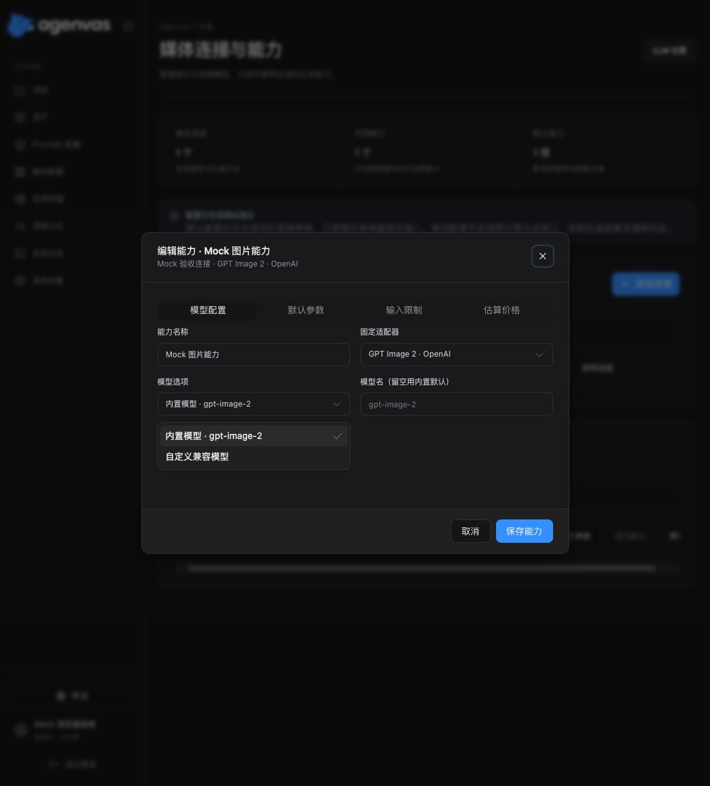
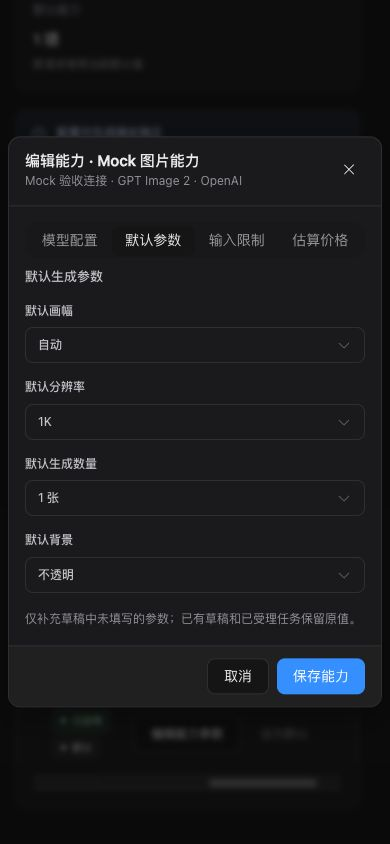

# shadcn 公共组件迁移验证

日期：2026-10-02。范围为前端公共组件及调用页面，没有后端、OpenAPI、生成 API 类型或 Flyway 迁移。

## 实际实现

- 按用户给定的 `pnpm dlx skills add shadcn/ui` 安装项目 skill，源码位于 `.agents/skills/shadcn`，锁定来源记录在 `skills-lock.json`；仓库同时提供的 `migrate-radix-to-base` skill 已随安装落盘，本次仍使用既定的 Radix。
- 在 `frontend/components.json` 配置 Vite / Tailwind 4 / Radix / Phosphor 与 `@/shared/ui/primitives` 目录，TS 和 Vite 解析同一别名。通过 shadcn CLI 添加并维护 Select、DropdownMenu、Table、Dialog、Button、Input、Textarea、Checkbox、Tabs、Switch、Field、ToggleGroup、Command、Alert、Badge、Empty 等组件源码。
- 公共 Select 以隐藏原生控件桥接既有 option、optgroup、change、FormData 和 required API；可见控件与定位、键盘由 Radix 实现。Tab 在关闭焦点回调中移到相邻字段，避免帧回调与触发器焦点恢复发生竞态。
- 删除旧的手写 DropdownMenu。模型、工具、设置和版本选择使用 Radix 菜单，三视图用 Sub 组合；引用补全及画布添加卡片使用 Command。引用来源悬停菜单进入 Portal 后继续保持打开，异步版本选用保持原错误、CAS 与关闭时机。
- 媒体设置、调用日志、系统日志采用 Table；媒体编辑与系统设置采用 Tabs；按钮、文本输入、复选框、开关、状态和空态调用公共 primitives。媒体参数选项用 ToggleGroup，媒体设置表单用 FieldSet/FieldGroup/Field。业务 Dialog 负责标题、原提交表单、等待禁止关闭与固定页脚，Radix 管理模态隔离和焦点。
- shadcn 语义颜色映射到现有 `--ui-*`。旧全局输入样式不再覆盖 primitives；画布使用 isolation，避免 React Flow 工具栏遮住 body Portal。领域播放器、画笔、手势、资源编辑器保留专用实现。
- 新增直接依赖精确锁定：radix-ui 1.6.7、class-variance-authority 0.7.1、cmdk 1.1.1、cn 0.4.0。已有 401 个依赖包记录均保留，新增 78 个包记录。

## 实际检查

45 个相关前端测试文件，共 355 项已验证通过。合并运行先暴露出旧按钮语义断言和 Tab 焦点竞态：43 个文件完整通过，随后修正另外 2 个文件并定向重跑 22 项全部通过。没有运行全量测试。

合并覆盖命令（在 frontend 执行）：

```sh
pnpm test \
  src/shared/ui/Select.test.tsx \
  src/shared/ui/Dialog.test.tsx \
  src/shared/ui/DropdownMenu.test.tsx \
  src/features/canvas/MediaCanvasCard.test.tsx \
  src/features/canvas/MediaDraftEditor.test.tsx \
  src/features/settings/MediaSettingsPage.test.tsx \
  src/features/settings/SystemSettingsPage.test.tsx \
  src/features/auth/LoginPage.test.tsx \
  src/features/auth/SetupPage.test.tsx \
  src/features/projects/ProjectsPage.test.tsx \
  src/shared/ui/PageShell.test.tsx \
  src/shared/i18n/i18n.test.tsx \
  src/features/settings/LlmSettingsPage.test.tsx \
  src/features/settings/StorageSettingsPage.test.tsx \
  src/features/settings/SystemLogsPage.test.tsx \
  src/features/settings/DebugModeSection.test.tsx \
  src/features/settings/CallLogRetentionSection.test.tsx \
  src/features/settings/PasswordChangeSection.test.tsx \
  src/features/settings/CallLogsPage.test.tsx \
  src/features/settings/FormattedCallExchange.test.tsx \
  src/features/settings/CallDebugDetails.test.tsx \
  src/features/library/LibraryPage.test.tsx \
  src/features/library/LibraryReferencePicker.test.tsx \
  src/features/library/SaveToLibraryButton.test.tsx \
  src/features/library/TextAssetSave.test.tsx \
  src/features/canvas/ProjectWorkspacePage.test.tsx \
  src/features/canvas/ProjectWorkspaceImageLayout.test.tsx \
  src/features/canvas/ContentCanvasCard.test.tsx \
  src/features/canvas/CanvasSelectionClearing.test.tsx \
  src/features/canvas/ArtifactVersionEditing.test.tsx \
  src/features/canvas/MediaVersionPicker.test.tsx \
  src/features/canvas/RunningHubForm.test.tsx \
  src/features/canvas/BrushMarkupEditor.test.tsx \
  src/features/canvas/CropPanel.test.tsx \
  src/features/canvas/CanvasKeyboardDeletion.test.tsx \
  src/features/canvas/ArtifactCardFrame.test.tsx \
  src/features/canvas/ArtifactCardFrameGestures.test.tsx \
  src/features/canvas/AgentChatCard.test.tsx \
  src/features/canvas/AgentRunConversation.test.tsx \
  src/features/canvas/AudioPromptTools.test.tsx \
  src/features/canvas/BlockedRunNotice.test.tsx \
  src/features/canvas/CanvasItemTitleEditor.test.tsx \
  src/features/canvas/MediaCardUpload.test.tsx \
  src/features/canvas/TextGenerationEditor.test.tsx \
  src/features/canvas/UnknownTaskRetryPanel.test.tsx
```

修正后重跑：

```sh
pnpm test src/features/canvas/ProjectWorkspaceImageLayout.test.tsx src/shared/ui/Select.test.tsx
pnpm lint
pnpm build
git diff --check
```

- 重跑：2 个文件、22 项通过；其余已通过文件没有再重复执行。
- lint：主题集中检查、四语言文案检查及 ESLint 通过。
- build：TypeScript 与 Vite 生产构建通过；仍有超过 500 kB 的产物分块提示，未进行额外打包优化。
- diff 检查通过。测试环境使用 MSW 与 jsdom；jsdom 对 HTMLMediaElement.pause 的未实现提示不代表真实播放验证。
- 覆盖原生表单值、禁用组、必填校验、键盘/焦点、外部关闭、异步失败、草稿保留、CAS、版本选用、费用确认、设置提交、画布拖动/框选与删除快捷键保护。测试交互使用可见 shadcn 控件；画布拖动测试继续使用其原有事件序列。

## 隔离 Mock 浏览器

用临时 Vite 入口和仅包含 Mock 配置的 fetch fixture 验证真实浏览器 DOM；临时文件、浏览器页签和服务已清理。没有连接真实 Provider。

- 桌面：能力编辑、Tabs 与弹窗内 Select 可用；第一次 Escape 关闭 Select，第二次关闭 Dialog，焦点回到“编辑能力参数”。
- 390 × 844：弹窗 left=8、right=382，宽 374；Select left=24、right=366，位于视口内。连接/能力表格的横向滚动在自身容器中完成，没有撑宽页面。
- 手机截图采用最终表单组合与横向页脚布局。截图是界面布局证据，不是后端或生成能力证据。






## 验证边界

全量测试、后端测试、容器构建、部署与真实 Provider 调用均未运行。浏览器手工验收集中在媒体设置的桌面/手机布局；画布交互由相关单元测试覆盖，未做全部画布操作的浏览器验收。

参考：[shadcn skills](https://ui.shadcn.com/docs/skills)、[Radix Select](https://ui.shadcn.com/docs/components/radix/select)、[Radix DropdownMenu](https://ui.shadcn.com/docs/components/radix/dropdown-menu)、[Table](https://ui.shadcn.com/docs/components/radix/table)。
