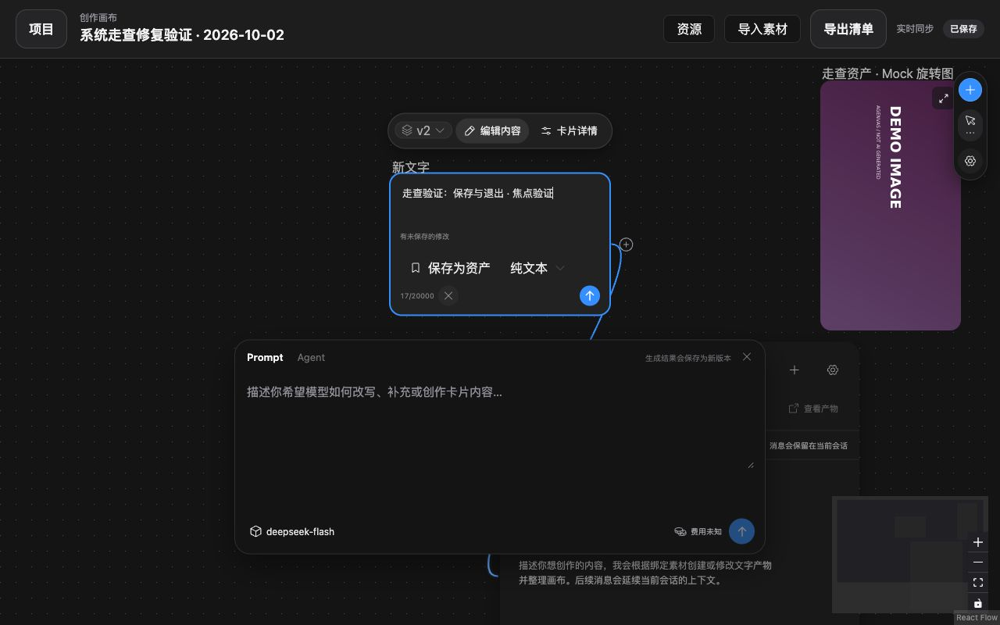
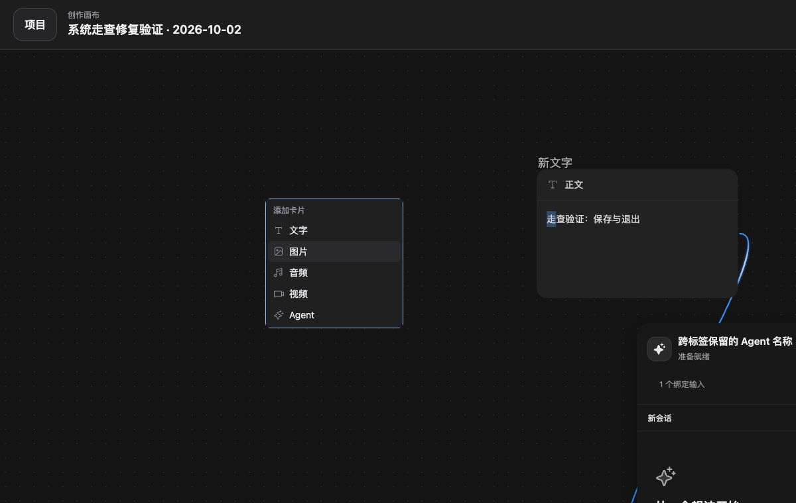

# 系统走查与修复（2026-10-02）

目标：全量走查系统，持续记录错误和有问题的交互，完成页面级走查后自动修复。已覆盖下方 18 类页面/流程并修复 W01–W12；实际复测、专项测试与未实测边界分别记录。本结论不代表所有外部 Provider、网络恢复和设备组合均已验收。

## 环境与边界

- 当前工作区 Vite 前端：`http://localhost:5173`，API 代理至已有 Compose 后端 `http://localhost:8080`；前端采用当前未提交代码，后端为正在运行的镜像。
- Chrome 现有管理员登录会话；内置浏览器用于未登录入口检查。独立项目：`系统走查 · 2026-10-02`，ID `9a5eaed1-1677-4df0-8e16-3b575a6dd373`。
- 已观察桌面默认视口与规格最小桌面视口 1280×800。当前文字模型为真实配置 `deepseek-flash`，不在本次走查中发起收费生成。媒体生成使用 Mock 验证。
- 本轮没有运行全量自动化测试，不把历史截图或历史测试当作本轮证据。

## 覆盖清单

| 步骤 | 范围 | 当前状态 |
|---|---|---|
| 1 | 初始化、未登录入口、登录 | 已初始化保护；未登录项目跳登录；空密码必填校验。未提交新凭证 |
| 2 | 项目列表、创建、搜索、重命名、归档 | 浏览器完成；测试项目已归档，现规格没有恢复入口 |
| 3 | 空画布、新建节点、布局、工具与键盘 | 五类节点、菜单、工具、选中/键盘；新 Agent 选中与适屏复测 |
| 4 | 文字编辑、保存、版本、离开保护 | 保存 v2、脏状态版本禁用；显式退出确认/继续/保存退出浏览器完成；失败/CAS 专项测试 |
| 5 | 图片草稿、Mock 生成、批量、取消、版本 | 两张 Mock 批量与自动保存完成；取消/UNKNOWN/失败由专项测试覆盖，未现场复现长期任务取消 |
| 6 | 图片智能编辑与后处理 | 本地旋转派生；模型菜单 Esc、草稿保护、焦点隔离/恢复复测；未发起付费编辑 |
| 7 | 视频草稿、参考、播放与版本 | Mock 2 秒视频显式播放通过；参考/CAS/任务状态专项测试，未调用真实视频 Provider |
| 8 | 音频草稿、音色、播放与 MV | Mock 提示音播放；音色搜索/模板；v2→v1 保留草稿；MV 独立草稿引用固定 v1 |
| 9 | Agent 配置、会话、预检与历史 | 创建、预检返回修改；设置跨标签草稿保留与保存复测；未确认付费运行 |
| 10 | 项目资源、素材导入与导出清单 | 资产导入；本地化类型与默认结果标签；导出 JSON 已解析 schemaVersion=4。本地上传受扩展权限阻止 |
| 11 | 个人资产保存、搜索、复用、分类与回收站 | 保存/导入/详情/收藏/搜索空态/回收站恢复；卡片高度及缩略图复测；未永久删除 |
| 12 | Provider 配置与诊断入口 | 掩码、配置表单、诊断确认入口只读检查；未修改配置或付费诊断 |
| 13 | 媒体连接、能力、默认模型 | 4 连接/6 能力/3 默认项；新增平台字段切换取消；公共弹窗菜单层级复测 |
| 14 | 存储配置 | 本地默认与新增云存储表单检查；未提交云凭证/连接 |
| 15 | 调用日志、筛选与详情 | 走查项目 6 条本地/Mock 调用；既有文本 Prompt 明细搜索、角色和行对齐实测 |
| 16 | 系统日志 | 关键词空态、自动刷新、缓存上限/淘汰提示；未清理历史 |
| 17 | 系统设置、语言与导航 | 常规/安全/日志/诊断四分区及导航；当前中文；四语言目录通过自动检查，其他语言未逐页视觉检查 |
| 18 | 窄屏、键盘、错误恢复、冲突与未授权 | 最小桌面 1280×800 及默认桌面；模态/菜单键盘浏览器复测；失败/冲突/UNKNOWN 专项测试；手机端及真实断网/SSE 重连未本轮实测 |

## 已复现的问题

### W01 · P1 · 退出文字编辑会无提示丢失未保存内容

步骤：新建文字 → 编辑内容 → 保存新版本 → 输入不同文字 → 点击“退出内容编辑” → 再次“编辑内容”。结果：没有确认、没有自动保存，重新进入后仅有上次保存文字，未保存输入丢失。页面顶栏仍显示“已保存”。

代码：`TextCanvasEditor.tsx` 退出按钮直接调用 `onDone`，`ContentCanvasCard.tsx` 通过条件卸载编辑器；修改状态仅在 `useArtifactRevision` 内保存。新版本保存成功，版本选择在脏状态禁用，这两项保护有效，但无法覆盖退出。

建议：退出与卸载前保护草稿，显示准确的内容保存状态；不要只保护 API 保存失败。

证据：[未保存修改](images/system-walkthrough-2026-10-02/04-text-unsaved.png)、[退出并重开后](images/system-walkthrough-2026-10-02/05-text-draft-lost.png)。

### W02 · P1 · 最小桌面视口下底部文字生成操作超出屏幕

步骤：1280×800 → 空项目 → 添加文字节点。结果：编辑区实际 top=649.5、height=275、bottom=924.5，超出屏幕 124.5px；模型、费用和生成按钮不可见。

证据：[文字节点](images/system-walkthrough-2026-10-02/03-text-node.png)。建议：浮动编辑区定位考虑自己的实际高度及视口限制，必要时提供内部滚动并保持操作栏可见。

### W03 · P3 · 中文画布的缩放控件可访问名称未本地化

当前 DOM / 辅助功能树仍显示 `Zoom In`、`Zoom Out`、`Fit View`、`Toggle Interactivity`、`Control Panel`、`Mini Map`。对使用中文读屏的用户不一致；截图不能单独证明读屏体验。

证据：[空画布](images/system-walkthrough-2026-10-02/02-empty-canvas.png)，对应当前树读取。建议：使用 React Flow 的本地化标签入口统一名称。

### W04 · P2 · 文字编辑工具条溢出卡片边界

1280×800 新建文字节点自动放大后，编辑器底部“保存为资产”、格式、字数、退出、保存按钮排成不换行的一行，后面三个控件穿出卡片右边界。CSS `.text-card-editor-footer { overflow: visible; }`，父级 flex 没有换行，资产按钮标签使最小宽度超过节点。

证据：[编辑工具条溢出](images/system-walkthrough-2026-10-02/04-text-unsaved.png)。建议：保留节点边界内可用空间，调整工具条组合或换行，不靠隐藏操作解决。

### W05 · P1 · 智能编辑模型菜单按 Esc 会关闭整个编辑器并丢输入

步骤：选中图片 → 智能编辑 → 输入编辑要求 → 展开“图片能力” → 按 Esc。结果：模型菜单和整个智能编辑窗口同时关闭，画布也取消选中。重新打开编辑器输入为空；不是只关闭当前菜单。

代码：`SmartEditDialog.tsx` 注册 window keydown，所有 Escape 无条件调用 `onClose()`，未考虑子菜单已处理；草稿存在组件 state。

证据：[关闭前](images/system-walkthrough-2026-10-02/09-smart-edit-menu-before-escape.png)、[Esc 后整个窗口消失](images/system-walkthrough-2026-10-02/10-smart-edit-escape-closes-all.png)。建议：由模态栈处理 Escape，关闭编辑器时保护提示词和蒙版。

### W06 · P1 · 智能编辑模态窗口没有隔离键盘焦点

打开智能编辑后焦点仍停在底层“智能编辑”触发按钮。按一次 Tab，焦点进入底层“深度提取”；读 DOM 确认 `insideDialog=false`。窗口虽然声明 `role=dialog` / `aria-modal=true`，底层仍能被键盘访问。退出也未恢复触发按钮焦点。

证据：步骤 6 的当前辅助功能树与 DOM 焦点测量；[窗口外观](images/system-walkthrough-2026-10-02/08-smart-edit.png)。建议：使用公共模态组件的焦点隔离、初始焦点和关闭恢复机制。

### W07 · P2 · 添加 Agent 后仍保持旧媒体编辑区选中并遮住新卡片

步骤：选中 MV 草稿 → “+” → Agent → 填写名称 → 添加到画布。结果：新 Agent 放在旧媒体编辑区后方，旧节点保持选中，编辑区遮住 Agent 的标题、会话和部分内容；需主动关闭编辑区才能使用新卡片。

证据：[MV 编辑区遮住新 Agent](images/system-walkthrough-2026-10-02/17-mv-and-agent-overlap.png)。建议：创建完成后选中新 Agent 并清除旧媒体编辑区，同时安排可见且不重叠的落点。

### W08 · P2 · Agent 设置切换到聊天会丢失未保存名称

复现：Agent 设置 → 名称输入“走查 Agent 未保存名称” → 聊天 → Agent 设置。名称恢复成“走查 Agent”，没有提示。修复应保留同一卡片的未保存设置及 CAS 基准，避免标签切换丢输入。

### W09 · P2 · 项目资源把已有节点结果显示为“草稿”，类型暴露原始枚举

成功生成图片、视频、音频后，资源列表仍显示 `IMAGE · 草稿` 等标签。资源默认版本独立于节点选用结果是正确领域约束；问题在于标签把“未设置资源默认结果”混同“没有生成结果”。修复只改展示文案并本地化类型，不自动改变资源默认版本。

证据：[资源列表](images/system-walkthrough-2026-10-02/19-project-resources.png)。

### W10 · P2 · 资产选择器的“查看”动作实际上立即创建画布节点

资源抽屉“我的资产”点击 `查看 走查资产 · Mock 旋转图` 立即执行导入，出现“资产已放到画布”，没有打开详情。共享 LibraryBrowser 的动作名需要按页面、画布导入、参考选择三个上下文准确区分。

证据：[导入结果](images/system-walkthrough-2026-10-02/20-library-import-from-view.png)。

### W11 · P1 · 资产网格卡片被压缩成 36px，缩略图和信息截断

全局资产页和画布资产抽屉均复现。DOM 检查卡片主按钮 `height=36px`，来自公共 Button 固定高度；Library.css 设置 grid 但没有恢复自动高度。图片、名称、分类、时间被挤在一条细条中。

证据：[资产页卡片](images/system-walkthrough-2026-10-02/21-library-collapsed-cards.png)。修复保持收藏按钮尺寸，仅让主卡片按钮随内容增长。

### W12 · P1 · 公共模态提层后，设置表单下拉菜单被遮住（修复期间发现的回归）

步骤：媒体配置 → 添加连接 → 平台下拉框。Radix listbox 存在，但截图中没有菜单；DOM 测量菜单 z-index=50，弹窗=2400，菜单中心 elementFromPoint 命中弹窗而非菜单。此问题由本轮提高公共弹窗层级引入，必须在完成前修正。公共菜单使用集中定义的弹出层级，高于模态；不为每个表单写独立魔法值。

证据：[被挡住的下拉框](images/system-walkthrough-2026-10-02/34-settings-menu-layer-regression.png)。

## 已观察的正向结果

- 已初始化实例不允许再次创建管理员，并给出登录链接。
- 项目创建成功后清空名称输入，列表立即出现新项目且提供打开入口。
- 空画布有添加节点提示；文字保存创建 v2，已保存内容可重新查看。
- Mock 图片批量 2 张成功：首张保留当前节点，第二张出现独立节点；结果标注“演示素材”。模型切换、参数切换与提示词会自动保存，待保存期间运行按钮禁用。
- 本地旋转结果创建“新图片 · 旋转”独立节点，存在持久派生线，空白草稿不继承来源提示词或能力。图片结果保存为个人资产成功并显示分类及查看入口。
- Mock 2 秒文生视频生成成功；默认海报，点击播放后 `<video>` readyState=4、duration=2、error=null，已播放到 2 秒并结束。尝试取消时任务已完成，没有实际执行到取消请求，不能据此宣称取消通过。
- 音频自然对白模板应用成功；搜索 Vivi 正确过滤；Mock 音色试听禁用且说明只生成提示音，不冒充语音合成。
- Mock 音频生成成功，明确标注非语音合成；显式播放 readyState=4、duration=3、paused=false、error=null。重新生成新增节点内 v2；切回 v1 后草稿提示词保持。MV 创建独立视频草稿，固定音频 v1 引用，无自动视频任务。

## 截图索引

1. [项目页](images/system-walkthrough-2026-10-02/01-projects.png)
2. [空画布](images/system-walkthrough-2026-10-02/02-empty-canvas.png)
3. [文字节点](images/system-walkthrough-2026-10-02/03-text-node.png)
4. [文字未保存修改](images/system-walkthrough-2026-10-02/04-text-unsaved.png)
5. [文字修改丢失](images/system-walkthrough-2026-10-02/05-text-draft-lost.png)
6. [图片草稿](images/system-walkthrough-2026-10-02/06-image-draft.png)
7. [Mock 批量结果](images/system-walkthrough-2026-10-02/07-mock-image-batch.png)
8. [智能编辑](images/system-walkthrough-2026-10-02/08-smart-edit.png)
9. [智能编辑模型菜单](images/system-walkthrough-2026-10-02/09-smart-edit-menu-before-escape.png)
10. [Esc 误关闭整个编辑器](images/system-walkthrough-2026-10-02/10-smart-edit-escape-closes-all.png)
11. [本地旋转与派生草稿](images/system-walkthrough-2026-10-02/11-local-rotate.png)
12. [个人资产保存成功](images/system-walkthrough-2026-10-02/12-library-save-success.png)
13. [Mock 视频结果](images/system-walkthrough-2026-10-02/13-mock-video-result.png)
14. [音频草稿](images/system-walkthrough-2026-10-02/14-audio-draft.png)
15. [音色库搜索](images/system-walkthrough-2026-10-02/15-audio-voice-library.png)
16. [Mock 音频播放](images/system-walkthrough-2026-10-02/16-mock-audio-playback.png)
17. [MV 草稿与新 Agent 遮挡](images/system-walkthrough-2026-10-02/17-mv-and-agent-overlap.png)

## 修复状态与验证

| 问题 | 实际修复 | 验证 |
|---|---|---|
| W01 | TextCanvasEditor 退出确认、保存退出、未保存状态、beforeunload 提醒；失败不退出 | 浏览器继续编辑保留输入、保存退出生成 v2；新增 CAS 冲突回归保留草稿/基准 |
| W02 | ProjectWorkspacePage 文字也参与节点聚焦空间预留 | 1280×800 编辑区 top=434.5、height=275、bottom=709.5；按钮完整可见 |
| W03 | React Flow ariaLabelConfig 与四语言目录 | 中文辅助功能树标签；i18n 检查 |
| W04 | 文字工具条允许换行 | 280px 卡片所有按钮 right≤780、bottom≤402.5，均在节点边界内 |
| W05 | SmartEditDialog 公共模态/退出确认；画布 Esc 尊重模态与弹出层 | 集成测试先失败 selectedIds=[]，修复后通过；完整刷新浏览器首次 Esc 仅关菜单，第二次确认退出 |
| W06 | Radix Dialog 焦点隔离/恢复，集中弹窗层级，全屏 translate 重置 | 开启焦点进入退出按钮、Tab 留在弹窗、退出恢复智能编辑按钮 |
| W07 | 创建 Agent 后选中新节点并适屏 | 浏览器新 Agent 可见，旧文字/媒体编辑区关闭 |
| W08 | Agent 配置提升到卡片 state，保留原 CAS 基准 | 新增跨标签回归先失败后通过；浏览器修改名称→聊天→设置保留并保存成功 |
| W09 | 本地化资源类型，准确展示默认结果状态 | 资源显示图片/文字及“已设置默认结果”；未自动改写资源默认版本 |
| W10 | LibraryBrowser 按查看/画布/参考语义命名动作 | 浏览器“放到画布”成功；参考选择专项回归 |
| W11 | 资产主按钮自动高度与正常换行 | 抽屉主按钮从 36px 恢复 356px；全局页高 275px、缩略图 173.25px，信息完整 |
| W12 | 公共 Select/DropdownMenu 使用 --ui-z-popup=2500，高于 --ui-z-dialog=2400 | 重开菜单后 menuReceivesPointer=true；点击 Seed Audio 选项成功并取消表单 |

修复期间浏览器曾保留热更新旧监听器/Popper 层级缓存，最终复测使用完整刷新或重新挂载菜单；不把 HMR 中间状态当成最终证据。

本次改动位于前端画布、资产、公共模态/菜单、翻译目录；同步 `docs/MVP-SPEC.md` 与 `docs/frontend-design-system.md`。没有后端、API 合约或数据库迁移。

### 实际运行的检查

| 命令范围 | 结果 |
|---|---|
| ProjectWorkspacePage、CanvasSelectionClearing、MediaDraftEditor、FormattedCallExchange、CallLogsPage、Select、Dialog | 7 文件 / 121 项通过 |
| ContentCanvasCard、SmartEditDialog、AgentChatCard、ProjectWorkspaceImageLayout、LibraryReferencePicker、LibraryPage | 6 文件 / 45 项通过 |
| MediaCanvasCard、CanvasKeyboardDeletion | 2 文件 / 59 项通过 |
| Select、DropdownMenu、Dialog、MediaSettingsPage（W12 追加回归，含重复文件） | 4 文件 / 38 项通过 |
| pnpm lint | 主题颜色、四语言 1791 条目录及 ESLint 通过 |
| pnpm build | TypeScript 与 Vite 生产构建通过；保留现有 >500kB 分块提示 |
| git diff --check | 通过 |

以上为定向回归批次，追加批次有重复用例，不将次数叠加当作独立测试数。未运行全量测试，未运行后端测试（没有后端变更）。jsdom 的 HTMLMediaElement.pause 未实现提示没有导致失败；真实音视频播放的浏览器证据另列。

### 未实测限制

真实收费 LLM/媒体调用、真实云存储、账户凭证修改、永久删除、手机视口、真实网络断线/SSE 补发及服务重启恢复未本轮实测。上传因 Chrome 扩展文件权限未实际完成，未调整浏览器安全权限。取消尝试时 Mock 已完成，取消/UNKNOWN 仅以专项自动化回归作为本轮验证。文字显式退出和浏览器离开提醒不代表跨路由保存未提交正文。

修复后截图：[资产抽屉卡片](images/system-walkthrough-2026-10-02/30-library-cards-fixed.png)、[全局资产卡片](images/system-walkthrough-2026-10-02/36-global-library-fixed.png)、[智能编辑保留输入](images/system-walkthrough-2026-10-02/31-smart-menu-fixed.png)、[1280×800 文字编辑区](images/system-walkthrough-2026-10-02/32-text-editor-viewport-fixed.png)、[Agent 设置保留](images/system-walkthrough-2026-10-02/33-agent-config-retained.png)、[公共弹窗菜单](images/system-walkthrough-2026-10-02/35-settings-menu-layer-fixed.png)。

## 操作记录（保留的上下文）

- Agent 运行前确认显示真实模型 deepseek-flash，返回修改保留任务输入；未确认真实模型调用。
- 项目资源抽屉可读取；个人资产导入到画布成功。资产详情收藏保存、搜索空态、移入回收站、恢复均实测；没有永久删除。
- Provider 配置掩码展示，付费诊断未确认时禁用；没有修改配置或调用外部服务。
- 媒体连接新增弹窗及平台字段切换检查，包含 Seed Audio；取消新增，未保存配置。能力表格及默认状态可见。
- 存储当前为本地，新增云存储字段可见；未更改默认存储或提交凭证。
- 调用日志按走查项目筛选得到 6 条本地/Mock 调用，详情关联已完成任务；Mock 正文明示无真实 HTTP 请求。文本调用筛选及已有 Prompt 详情实测，行高 69.78/48.59px、垂直居中且预览不溢出，搜索“古风”同步切换用户消息详情。
- 系统日志关键词空态、自动刷新、缓存边界提示检查。系统设置常规、安全、日志、诊断四分区检查；没有修改密码、清理历史或调整 debug。
- IAB 未登录访问 /projects 跳转 /login；空密码提交被必填校验阻止。未输入账户凭证。
- 测试项目重命名和归档成功；项目规格没有恢复操作，原测试项目现在归档（名称“系统走查 · 2026-10-02 · 验证”），不直接修改数据库还原。
- 新建修复验证项目“系统走查修复验证 · 2026-10-02”，ID `cdaba9af-e0ac-43b0-bc77-9406295440cc`。后续 UI 复测在此继续。
- 画布设置/工具菜单与 Esc 单层关闭检查；导入素材入口检查。Chrome 扩展未启用文件 URL 权限，filechooser.setFiles 被阻止，未实际上传；保留此限制，不能声称上传实测通过。
- 导出清单已下载并解析，schemaVersion=4，项目 ID/名称及结构正确。
- W01–W12 修复与复测已完成，检查结果见上方。测试项目和个人 Mock 资产保留供复查。

新增截图：18-agent-preflight、19-project-resources、20-library-import-from-view、21-library-collapsed-cards、22-library-trash-detail、23-provider-config、24-media-settings、25-storage-settings、26-prompt-rows-aligned、27-system-log-empty-search、28-system-diagnostics、29-login-required，均位于 images/system-walkthrough-2026-10-02/。

## 后续文案调整（2026-10-02）

按用户要求，系统诊断的本地工作目录成功状态移除固定括注“（未试写）”，显示“路径检查正常”。同步四语言目录及既有测试，未改变诊断检查行为。SystemSettingsPage 5 项专项测试、i18n 检查及 git diff --check 通过；本次文案改动未另运行生产构建或浏览器实测。

## 后续文字卡片修复（2026-10-02）

用户反馈文字卡片有两层边框、版本号需要放到上方工具栏并移除前面的文字标签，以及“编辑内容”点击无反应。

- 原因：选中卡片外圈与公共文本域焦点轮廓叠加；已处于编辑时按钮只重复设置编辑状态，没有恢复正文焦点。
- 调整：ContentCanvasCard 将版本选择移至浮动工具栏，移除正文底部的文字标签及重复版本入口。TextCanvasEditor 提供正文 ref 和草稿基准/脏状态/请求状态，工具栏保持未保存版本切换保护；远端更新不覆盖输入，保存或显式载入后同步版本号。首次和重复点击“编辑内容”均聚焦正文，不重置输入。ContentCanvasCard.css 取消正文内部轮廓，保留卡片外层选中/键盘焦点提示。
- 浏览器：当前 Vite 5173 应用在独立测试项目、1280×800 视口复测。文本域 border=0px、outline=none、box-shadow=none，选中卡片只有外层 2px 轮廓；重复编辑点击后正文获焦且输入保留；未保存时版本菜单提示并禁止切换。验证用临时输入已显式放弃，未修改原已保存正文。
- 文件：ContentCanvasCard.tsx、TextCanvasEditor.tsx、ContentCanvasCard.css 及对应测试；同步 MVP-SPEC.md、frontend-design-system.md。没有 API 合约、后端或数据库迁移。
- 检查：ContentCanvasCard、ArtifactVersionEditing、ProjectWorkspacePage、CanvasSelectionClearing、CanvasKeyboardDeletion 共 5 文件 / 73 项通过；追加保存后工具栏 v3 断言后重跑 ContentCanvasCard 12 项通过（与前批重复）。初次追加断言使用不存在的 toolbar role，改为现有“文字卡片操作”标签后通过；初次构建发现测试对象枚举推断过宽，补充 Artifact 类型后生产构建通过。pnpm lint、pnpm build（含 TypeScript）、git diff --check 通过。构建保留现有 >500kB 分块提示。
- 限制：未运行全量测试、后端测试或真实 Provider 调用；浏览器验证基于当前 Vite 源码，未部署到 8088 的静态前端。

## 后续添加卡片菜单修复（2026-10-02）

用户反馈双击画布的添加菜单向下拉伸，选项下方有大量空白。当前浏览器复现菜单内容高 196px，但 Command 默认 `h-full` 使外框高达画布全高 1112px。ProjectWorkspacePage.tsx 的此菜单增加 `h-auto`，公共 Command 和其他使用处保持原布局。同步 frontend-design-system.md；没有 API 或数据库改动。

修复后浏览器实测宽 208px、高 196px，右上角按钮与画布双击入口均生效；方向键从文字切到图片、Esc 关闭有效。底部双击时菜单 bottom=1153px，画布 bottom=1187px，五个选项完整可见。浏览器操作未创建卡片或调用 Provider。

ProjectWorkspacePage 23 项测试、pnpm lint 与 git diff --check 通过。未另运行生产构建、全量测试或后端测试。本次浏览器验证基于 Vite 5173 源码，未部署到 8088 静态前端。

