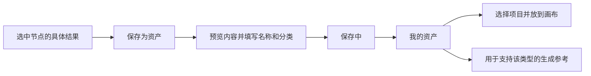

# 个人资产库设计

2026-10-01。状态：首版已实施（GitHub #24）。本文记录产品边界与实现行为，目标是让用户把画布上选中的创作结果保存为个人资产，按角色、场景、道具、其他分类，并在自己的不同项目中复用。

用户已确认分类保存的产品方向，以及“我的资产、跨项目复用”的账号级范围。本文的内容快照、页面细节、数据结构与 API 已进入首版实现；验收状态见 [开发清单](../../DEVELOPMENT-CHECKLIST.md)，边界记录见 [ADR 0026](../../adr/0026-personal-asset-library.md)。实际运行的检查与未验证限制见 #24 实施证据（开发记录不随源码公开）。

## 现有实现与新增范围

当前项目已经有项目内 Artifact、不可变 ArtifactVersion、按项目鉴权的 Asset 文件，以及“项目资源”抽屉。抽屉可以把产物重新放到画布，媒体节点固定精确版本，并有独立草稿与历史；本次增加账号级分类资产库。

新增资产库是用户主动挑选结果的目录。画布自动保存继续保存项目工作状态；“保存为资产”是独立操作，不要求每次保存画布都弹窗。

| 对象 | 范围与用途 |
| --- | --- |
| 项目资源 | 当前项目的产物与历史，包括尚无结果的媒体草稿 |
| 我的资产 | 当前账号主动保存的可复用内容，跨本人项目使用 |
| 资产分类 | 角色、场景、道具、其他，描述内容用途 |
| 媒体类型 | 文字、图片、视频、音频，决定预览与复用能力 |

分类与媒体类型独立。例如角色分类可以保存人物图片、角色说明文字或角色音频，场景分类也可以保存场景图片、视频或环境音。它们不增加 CHARACTER、SCENE、SHOT 产物类型，不恢复规划链路；创作类型仍为 TEXT / IMAGE / VIDEO / AUDIO。

## 资产页面

主导航在“项目”之后增加“资产”，路由 `/library`。页面使用现有 PageShell、蓝色主题与公共控件，保留用户参考图的紧凑分类按钮、搜索和缩略图网格布局。

页面从上到下排列：

1. 标题“资产”，右侧提供“上传资产”。
2. “我的资产 / 回收站”页签。首版不加入尚无来源与权限定义的“演员库”。
3. “全部 / 角色 / 场景 / 道具 / 其他”分类，显示当前账号对应页签下的数量。
4. 名称搜索、类型筛选、收藏筛选与排序。默认按最近保存；可切换按名称或最近修改。
5. 响应式资产网格，桌面随宽度增列，手机收为单列或双列。

分类数量统计该页签的完整分类集合，搜索结果另显示命中数量，避免把已加载的一页当作总数。搜索和筛选在服务端执行，采用稳定排序与游标分页，加载更多时保留已有卡片。

资产卡片显示缩略图、名称、类型、保存时间和收藏按钮。图片与视频使用归档缩略图；视频显示时长且不自动播放；音频显示类型与时长，点击详情后手动播放；文字显示正文摘要。没有缩略图时使用现有类型图标，不加载原视频作为列表封面。

点击卡片打开详情面板：预览内容、修改名称/分类、收藏、查看来源摘要、选择项目并“放到画布”、移入回收站。资产内容不可原地替换；新的创作结果保存为另一条资产。首次上传入口可放在工具栏或网格第一张操作卡，使用同一上传流程。

空态显示“还没有角色资产”等具体文案，提供“去画布创作”和已实现的上传入口。“生成”若后续提供，必须先选择项目并进入普通画布草稿，仍需用户点击运行；资产页不另建付费生成通道。

参考图中的“合集”适合以后作为跨分类的分组，例如“一部短片”同时收纳角色、场景和道具。它不作为第五种内容分类；合集、多标签、自定义分类与批量整理列入后续扩展。

## 从画布保存

图片、视频、音频节点的内容工具栏，以及文字节点的菜单，增加“保存为资产”。原有下载行为保留，菜单中将“下载文件”和“保存为资产”分别命名。

窗口标题为“保存为资产”，包含结果预览、名称、分类和底部“取消 / 保存资产”。名称默认取节点显示标题，分类初始值为“其他”，用户可以直接保存或改选角色、场景、道具。名称沿用现有标题的 160 个 UTF-16 代码单元上限；分类是必填枚举，字段限制用共享常量管理。

预览明确标出本次保存的节点结果，例如“海边旅馆 · 节点 v2”。服务端固定该 ArtifactVersion ID，不通过“最新版本”或资源默认版本重新推导。窗口打开后选用结果改变时提示刷新；提交时校验内容选择 epoch，不能用拖动引起的布局版本变化误报内容冲突。提交受理后内容已固定，之后的生成或选择变化不改变这次保存。

媒体草稿占位、没有归档结果的节点、Agent 节点不能保存为资产。正在生成但仍展示旧结果时，可以保存该旧结果。文字有未保存编辑时，先按现有 CAS 保存文字，成功后固定返回的版本；失败或冲突保留输入，不能收藏旧正文并显示成功。空白文字不创建资产。

保存只收藏这一份内容，不收藏整张工作卡片，不复制节点全部历史、媒体草稿、连线、任务、Agent 会话或 Provider 配置。首版不把完整生成配方纳入资产，以免引入跨项目输入引用与凭证泄漏；以后可以另行设计显式的配方复用。

保存完成后显示“已保存到我的资产 · 场景”，提供“查看资产”。保存失败保留名称、分类与固定预览；请求结果不明时先查询命令状态，再使用原命令键恢复，不反复创建资产。当前窗口在转存进行中暂不允许关闭；失败保留输入，完成后可以关闭。服务端已受理的转存不依赖浏览器连接，刷新或离开页面后仍继续执行。

同一账号重复收藏同一个来源版本时返回既有条目，提示“这个结果已保存为资产”。可打开条目修改分类，不能静默用新名称或分类覆盖旧值。条目在回收站时提示显式恢复；源节点的新版本可以另存为新资产。不同来源恰好具有相同字节不强制合并。

## 在项目中复用

画布现有资源抽屉增加“项目资源 / 我的资产”页签，资产页签提供同一套分类、名称搜索与类型筛选。用户选中资产后，可放到当前视口中心，也可由后续拖放入口指定位置。

“放到画布”将资产内容导入目标项目，创建该项目自己的 Artifact、首个 ArtifactVersion 与 CanvasItem。媒体文件先归档到目标项目的 Asset；节点仅带一个结果和空白媒体草稿，不继承来源任务、输入或连线。文字导入得到可独立编辑的文字节点。再次放置创建另一份独立创作身份，既有节点不会随资产改名、改分类或删除而更新。

图片和音频资产还可以在媒体输入选择器中“用于本次参考”。服务端先创建目标项目内的精确内容版本，再作为手动来源加入目标草稿；无需在画布额外摆放一个节点，也不自动建连或生成。成功提示具体使用位置，首版显示“已添加为参考”，参考条目通过既有位置与颜色标识显示。

| 资产类型 | 首版复用方式 |
| --- | --- |
| 文字 | 放到画布，继续按现有文字编辑与 Agent 上下文入口使用 |
| 图片 | 放到画布；用于支持图片的生成参考或指定首尾帧位置 |
| 音频 | 放到画布；用于支持音频的生成参考 |
| 视频 | 放到画布、预览和下载；不新增视频参考能力 |

分类不决定 Provider 能力。图片资产属于角色分类也不意味着支持人物一致性；“角色音频”也不自动成为指定 speaker ID。添加参考继续执行规格 6.11 的模式、模态、数量、大小、时长与 CAS 校验。需要模式切换、清除旧输入或替换首尾帧时，先展示完整影响并由用户明确选择，成功后原子提交；取消或校验失败不留下半份引用或孤立画布节点。

## 内容独立与生命周期

个人资产保存为独立内容快照。文字保存正文和格式，媒体保存经过核验的文件与预览。来源项目/节点/版本仅作可选追溯信息；读取资产不再依赖来源项目存在。源项目归档或后续物理清理时，已经成功保存的资产仍可用。

首版复制媒体文件到账号资产库，导入项目时再复制到目标项目，保持现有项目鉴权与精确版本边界。复制增加本地存储与 I/O，但避免把 Asset.projectId 变成可空权限字段、允许跨项目引用或重新设计全部文件归属。内容寻址去重可以以后做，不能仅因 hash 相同让不同账号相互读取。

回收站使用软删除，保留内容和分类，提供恢复。回收站条目不能被新导入；已导入的项目内容保持可用。首版不自动到期清空。永久删除只从回收站发起，界面明确说明不可恢复并要求确认；物理清理须等待活动本地转存操作结束，再核对引用及备份保留策略。

保存或导入操作受理时取得不可变来源快照与暂时的清理保护。受理后来源节点移除、源项目归档或资产移入回收站不改写这份快照，已受理操作可以完成；物理清理不能提前删除它正在读取的文件。尚未受理的新操作按来源当前状态拒绝。

个人资产库与已导入项目各自拥有字节，不通过删除级联影响对方。服务器备份覆盖数据库、项目媒体与账号资产库目录。项目导出清单继续只导出项目内容；独立资产库的导出/导入另行排期，不把账号全部资产混入单个项目导出。

## 领域与持久化结构

LibraryEntry 是用户界面中的“资产条目”，Asset 继续代表现有项目媒体文件。LibraryEntry 的内容快照不可变，名称、分类、收藏和回收站状态可用 expectedVersion 修改。

| 表 | 字段与约束 |
| --- | --- |
| `library_entry` | `id`、`owner_id`、`name`、`category`、`kind`、`content_schema_version`、`text_content` 或 `file_id`、只读来源摘要、`favorite`、`trashed_at`、`version`、UTC 时间；文字/文件互斥；分类与类型约束 |
| `library_file` | `id`、`owner_id`、服务端生成的对象键、实际 MIME、字节大小、hash、图片尺寸或媒体时长、预览元数据；稳定文件不可覆盖 |
| `library_command` | `id`、`owner_id`、命令键、payload hash、保存/导入的固定输入、状态、结果 IDs、租约、fencing epoch、错误摘要与时间；唯一 `(owner_id, command_key)` |
| `library_import` | 目标项目/ArtifactVersion、来源条目 ID 与名称/类型摘要快照；目标项目内外键与目标版本唯一约束，来源库删除不级联删除项目内容 |

分类枚举 `LibraryCategory = CHARACTER / SCENE / PROP / OTHER`；`kind` 复用四类产物枚举，字段不可混用。来源项目、节点和版本 UUID 是服务端核验后记录的弱追溯信息，不作为跨项目内容引用，也不形成阻挡源项目清理的外键。来源名称仅用于展示；打开来源时重新验证项目权限。

同一来源版本的重复收藏通过数据库唯一约束保护，例如仍存在条目的 `(owner_id, source_version_id)`，包含回收站条目。名称无需唯一。查询索引覆盖账号、删除状态、分类、更新时间及 ID，所有读取、内容流和更新均带账号范围。媒体条目的 `(owner_id, file_id)` 以同账号复合外键约束；导入关系的目标版本也以项目复合外键约束。

后端新增 `library` 业务模块。它通过 artifact、canvas、asset 的应用服务读取或创建项目内容，不跨用模块 Repository。存储模块提供经过鉴权的归档读取与本地流式复制能力；复用现有媒体解码校验，不接收任意磁盘路径、URL 或 Provider 地址。

本地转存命令使用 `ACCEPTED / ARCHIVING / SUCCEEDED / FAILED`，由有界本地执行器短事务认领，携带租约和 fencing epoch。复制文件不持有数据库事务，稳定目标 IDs/对象键支持重启核对。崩溃只恢复本地归档，不产生模型调用、费用或生成 UNKNOWN；错误不能返回成功。

保存流程为“校验并持久化固定输入 → 本地流式复制与 hash 核对 → 原子安装文件 → 短事务登记库文件/条目并提交命令结果”。失败暂存文件按命令恢复或清理，不能以空文件条目表示成功。

导入的文件准备完成后，Artifact、ArtifactVersion、CanvasItem 或媒体参考、导入追溯、命令结果与 project_event 在同一事务提交。草稿版本冲突时整笔业务变更回滚，准备好的文件由命令保留供原输入重试或安全清理。资产管理变更不伪造成项目事件；首版资产页用 TanStack Query 刷新、窗口重新聚焦与 CAS 处理多窗口变化，导入项目则使用已有 SSE。

## 接口

以下接口已加入权威 `contracts/openapi.yaml`，Java、生成 TS 与内容 Schema 同步；生成类型不手改。迁移 V67–V70 新增条目、独立文件、转存命令、导入追溯与持久清理队列。新增 source 查询接口固定保存窗口的预览与内容选择校验。

| 方法与路径 | 用途 |
| --- | --- |
| `GET /api/v1/library/entries` | 按分类、类型、收藏、回收站与名称查询，返回游标和筛选总数 |
| `GET /api/v1/library/entries/{entryId}` | 详情与不可变内容摘要 |
| `PATCH /api/v1/library/entries/{entryId}` | 用 expectedVersion 修改名称、分类或收藏 |
| `POST /api/v1/library/entries/{entryId}/trash` | 用 expectedVersion 移入回收站 |
| `POST /api/v1/library/entries/{entryId}/restore` | 用 expectedVersion 恢复 |
| `DELETE /api/v1/library/entries/{entryId}` | 永久删除回收站条目，带 expectedVersion |
| `GET /api/v1/library/entries/{entryId}/content` | 当前账号鉴权后的内容流，媒体支持 HEAD / Range |
| `GET /api/v1/library/entries/{entryId}/thumbnail` | 当前账号鉴权后的缩略图 |
| `POST /api/v1/projects/{projectId}/canvas-items/{itemId}/library-saves` | 固定展示版本保存；名称、分类、commandKey、媒体选择 epoch 或文字 CAS |
| `POST /api/v1/library/uploads` | 直接上传资产，multipart 加名称、分类与 commandKey；沿用实际解码限制 |
| `GET /api/v1/library/commands/{commandId}` | 查询本地转存状态与最终结果，结果不明时用于核对 |
| `POST /api/v1/library/commands/{commandId}/retry` | 仅对可恢复失败重试同一固定输入的本地转存 |
| `POST /api/v1/projects/{projectId}/library-imports` | 固定 entryId / expectedVersion 与 commandKey，导入并放置独立节点 |
| `POST /api/v1/projects/{projectId}/canvas-items/{itemId}/library-references` | 固定资产与目标草稿版本，导入并加入明确的参考位置 |

来源字段、ownerId、对象键、任务状态与来源证明由服务端产生。客户端不能通过普通 Artifact 写入接口伪造库导入。媒体新增服务端专用 `sourceType: LIBRARY_IMPORT` 内容分支，引用目标项目的 assetId；原生成出处作为导入追溯摘要保留，不伪造 UPLOAD 或不存在的 sourceTaskId。文字正文保持原 Schema，追溯记录在导入关系中。

转存命令统一返回 `202 Accepted` 和 commandId，只有命令 `SUCCEEDED` 才显示保存/导入成功。相同命令键与相同 payload 返回同一命令，payload 不同返回 `409 IDEMPOTENCY_CONFLICT`。并发内容或元数据冲突为 `409`；无结果为 `422`；未登录为 `401`；其他账号资源按现有防枚举约定返回 `404`。错误 code 与现有 ProblemDetail 约定统一，不能全部返回 200。

上传图片与音频复用现有实际解码规则。视频上传的格式、解码、大小及时长限制须在实施合约中明确，不能把“生成视频归档上限”直接当作用户上传已验收规则。所有数值限制来自共享常量或类型化配置。

## 开发顺序与验收

优先完成一个可验收切片：图片节点保存为分类资产 → 资产页筛选 → 导入另一项目 → 用作图片参考 → 删除来源节点后仍可使用。随后扩展文字、视频、音频，再收口上传、收藏和回收站；所有未交付入口保持隐藏，不摆放无法完成的按钮。

后续功能测试至少覆盖：

- 保存节点 v2 而资源默认为 v1，实际资产必须是 v2；来源重新生成不更改资产。
- 文字未保存、媒体空态、Agent、内容选择冲突与布局变化分别执行正确规则。
- 同键重放、同键不同 payload、并发重复收藏、回收站重复保存与恢复。
- 同账号跨项目导入成功，两账号通过条目、命令、文件、缩略图和导入 ID 均不能交叉读取或写入。
- 来源节点移除、项目归档/物理清理、资产软删除/永久删除，不破坏已完成的另一侧内容。
- 复制中崩溃、文件已安装但 DB 未提交、磁盘满和目标草稿冲突；恢复不重复导入或触发 Provider。
- 导入新节点只有首个结果和空白媒体草稿，已有引用不随资产元数据变化。
- 图片/音频参考继续遵循 6.11，模式切换取消无副作用，非法参考不留下部分业务记录。
- 分页搜索与计数、无结果、加载/失败/未授权、表单输入保留、键盘与窄屏布局。
- 导入事件与内容同事务提交，SSE 断线补发后得到同一节点和精确版本。

数据库并发与权限测试使用真实 PostgreSQL，前端通过 React 交互测试覆盖保存窗口、资产页、参考选择与文字 CAS。实测结果与限制见 #24 实施证据（开发记录不随源码公开）。本次没有真实 Provider 调用；全量测试曾发现三处失败，经定位修复后相关定向复跑通过，未再次重复全量。
